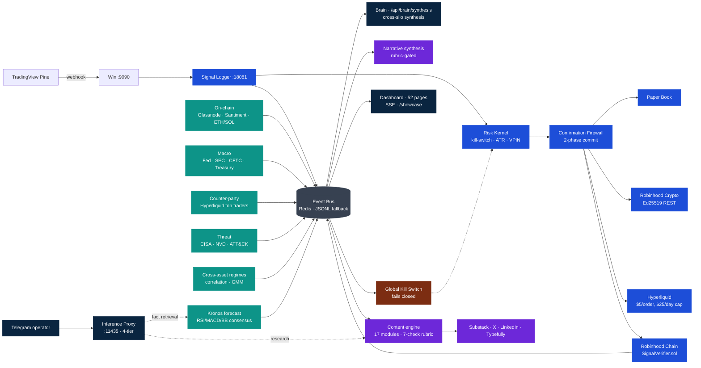
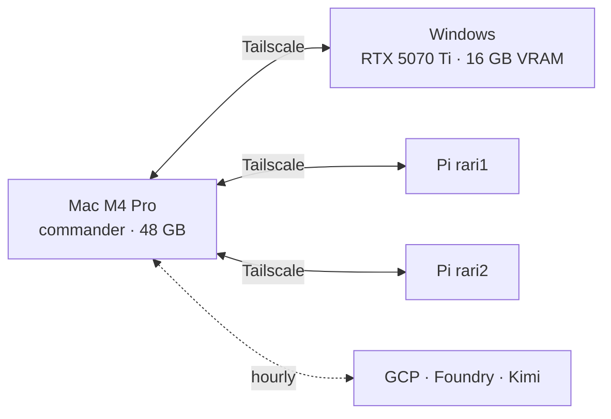

<div align="center">


# Sapphire OS

</div>

[](https://github.com/arigatoexpress/Sapphire/actions/workflows/ci.yml)
[](https://github.com/arigatoexpress/Sapphire/actions/workflows/security.yml)
[](https://codecov.io/gh/arigatoexpress/Sapphire)
[](scripts/ops/test_inventory.py)
[](infra/tool-registry.yaml)
[](services/dashboard/templates/pages)
[](https://sapphirealpha.xyz/api/brain/synthesis)
[](LICENSE)

**A self-sovereign operating system for capital intelligence, autonomous operations, and acquisition-grade diligence.**
We run trading, on-chain, threat-intel, regulatory, and content ops as one event-bus-mediated system on a four-node Tailscale mesh — no managed cloud runtime, no vendor lock-in, every artifact provenance-stamped.
Bloomberg charges $24K/seat to read; Glassnode shows you charts; Datadog watches your servers. We do all three plus autonomous trading, content publishing, and a fail-closed kill switch — on hardware we own, with code you can audit.

---

## Live

| Surface | URL |
|---|---|
| Public face | <https://sapphirealpha.xyz/> |
| Cross-silo Brain (synthesis) | <https://sapphirealpha.xyz/api/brain/synthesis> |
| Dashboard (auth: `sapphire`) | local `:8080/showcase` |
| Control plane | local `:8082` |
| Inference proxy (4-tier failover) | local `:11435/health` |
| Signal logger | local `:18081` |
| OpenBB (32 providers) | local `:6900` |

The Brain endpoint is the integration layer — health score, regime label, narrative, priority actions, degraded silos — synthesized from trading + regime + threat + services + inference + THO + threat_live silos every cycle.

## What sets this apart

| | Sapphire | Bloomberg Terminal | Glassnode | Recorded Future | Datadog | Notion + scripts |
|---|---|---|---|---|---|---|
| **Cost / seat** | $0 (own hardware) | $24K/yr | $799/mo | six figures/yr | per-host SaaS | per-seat SaaS |
| **Self-sovereign runtime** | yes (Mac + Win + 2 Pis on Tailscale) | no | no | no | no | no |
| **Autonomous trading w/ kill switch** | yes (paper + Hyperliquid + Robinhood) | no | no | no | no | no |
| **On-chain analytics** | 24+ providers, deterministic correlator | no | yes | no | no | no |
| **Threat intel** | CISA + NVD + ATT&CK live | no | no | yes | no | no |
| **Content engine w/ rubric gate** | 7-check institutional rubric | no | no | no | no | no |
| **Full-text auditability** | every artifact has a verdict + provenance | proprietary | proprietary | proprietary | proprietary | manual |
| **Acquisition-grade diligence dashboard** | `/diligence` + `/production-readiness` | n/a | n/a | n/a | n/a | n/a |
| **Smart-contract anchored signals** | 3 Solidity contracts on Robinhood Chain | no | no | no | no | no |

The differentiator is **integration discipline**. Most stacks sit beside each other; ours share an event bus, a kill switch, a sensitivity classifier, and a quality rubric — and the [Brain](https://sapphirealpha.xyz/api/brain/synthesis) collapses all of it into one health score and one narrative every cycle.

## Proof

| Surface | Count | Detail |
|---|---:|---|
| Passing tests | **7,184+** | 6,580+ unit · 604 plugin (`scripts/ops/test_inventory.py --check-readme`) |
| Test files | **436+** | `tests/unit/` and `plugins/claw-sapphire/tests/` |
| Plugin tools | **72** | CI-enforced via `scripts/validate_tool_registry.py` |
| Dashboard pages | **52** | Flask + SSE + basic-auth, unified `/showcase` |
| LaunchAgent definitions | **34** | Routines + soak gates |
| Data feeds | **20+** | Market · on-chain · macro · threat · counter-party · internal |
| Production-readiness sweep | **0 FAIL** | `--no-external` at Tranche 4 closeout |
| Smart contracts | **3** | Robinhood Chain testnet, chain ID 46630 |

First live BTC fill 2026-04-28 ($5 @ $76,774.81); 14-day Sortino soak before the $50 rung. Empirical accuracy at T+24h: BTC 83.3% (n=12), overall 61.1% (n=36 scored of 42); bearish 12.5% root-caused in [`docs/research/bearish-direction-asymmetry-2026-04-26.md`](docs/research/bearish-direction-asymmetry-2026-04-26.md).

## Quickstart (5 minutes)

```bash
# Requirements: Python 3.11+, Redis, Ollama, ruff. macOS 14+ commander; Windows 11 GPU node.

# 1. Install
pip install -r services/alpha/requirements.txt
pip install -r services/dashboard/requirements.txt

# 2. Secrets
cp env.example .env
cp .env.integrations.example .env.integrations
export AUTH_PASSWORD=sapphire
export TELEGRAM_BOT_TOKEN=<@BotFather>
export SAPPHIRE_CONTROL_API_TOKEN=<random-hex>

# 3. Core services (or let infra/launchagents/ run them)
python3 services/inference-proxy/app.py &                                       # :11435
(cd services/alpha && python3 -m uvicorn src.signal_logger:app --port 18081) &
(cd services/dashboard && python3 app.py) &                                     # :8080
(cd services/control-plane && uvicorn app.main:app --port 8082) &

# 4. Health
curl -s http://127.0.0.1:11435/health | python3 -m json.tool
curl -s http://127.0.0.1:18081/health

# 5. A plugin tool (stdin JSON)
echo '{"action":"quote","symbol":"BTC/USDT"}' | python3 plugins/claw-sapphire/tools/market.py
```

## Architecture

Six concerns, one event bus. Producers emit typed events; consumers subscribe without coupling. Redis Streams primary; JSONL fallback at `data/events/bus.jsonl` survives Redis outages.


```mermaid
flowchart LR
    classDef edge       fill:#0A2540,stroke:#0A2540,color:#fff
    classDef trading    fill:#1d4ed8,stroke:#1d4ed8,color:#fff
    classDef intel      fill:#0d9488,stroke:#0d9488,color:#fff
    classDef security   fill:#7c2d12,stroke:#7c2d12,color:#fff
    classDef content    fill:#6d28d9,stroke:#6d28d9,color:#fff
    classDef storage    fill:#374151,stroke:#374151,color:#fff

    Operator[Telegram operator]:::edge
    InferenceProxy[Inference Proxy<br/>:11435 · 4-tier]:::edge

    TV[TradingView Pine] -->|webhook| Win[Win :9090] --> SL[Signal Logger :18081]:::trading
    SL --> RK[Risk Kernel<br/>kill-switch · ATR · VPIN]:::trading
    RK --> CF[Confirmation Firewall<br/>2-phase commit]:::trading
    CF --> Paper[Paper Book]:::trading
    CF --> RH[Robinhood Crypto<br/>Ed25519 REST]:::trading
    CF --> HL[Hyperliquid<br/>$5/order, $25/day cap]:::trading
    CF --> Chain[Robinhood Chain<br/>SignalVerifier.sol]:::trading

    Bus[(Event Bus<br/>Redis · JSONL fallback)]:::storage

    SL --> Bus
    Chain --> Bus

    OnChain[On-chain<br/>Glassnode · Santiment · ETH/SOL]:::intel --> Bus
    Macro[Macro<br/>Fed · SEC · CFTC · Treasury]:::intel --> Bus
    CP[Counter-party<br/>Hyperliquid top traders]:::intel --> Bus
    Threat[Threat<br/>CISA · NVD · ATT&CK]:::intel --> Bus
    Regime[Cross-asset regimes<br/>correlation · GMM]:::intel --> Bus
    Predict[Kronos forecast<br/>RSI/MACD/BB consensus]:::intel --> Bus

    Bus --> Brain[Brain · /api/brain/synthesis<br/>cross-silo synthesis]:::edge
    Bus --> Narrative[Narrative synthesis<br/>rubric-gated]:::content
    Bus --> Content[Content engine<br/>17 modules · 7-check rubric]:::content --> Pubs[Substack · X · LinkedIn · Typefully]:::content
    Bus --> Dashboard[Dashboard · 52 pages<br/>SSE · /showcase]:::edge
    Bus --> KS[Global Kill Switch<br/>fails closed]:::security -.-> RK

    Operator --> InferenceProxy
    InferenceProxy -.fact retrieval.-> Predict
    InferenceProxy -.research.-> Content
```

## The Brain

`/api/brain/synthesis` is the cross-silo integration layer (PR #583, hero panel #585). The public JSON doc exposes safe posture fields (`health_score`, `confidence`, `regime`, redacted `narrative`, `degraded_silos`, `silos_observed`) while action counts, priority actions, correlations, history, persistence, signal counts, and inference volume require admin. Hit it: <https://sapphirealpha.xyz/api/brain/synthesis>. The cyber-threat-bot, regional-intel-workbench, and wildfire-watch satellites all feed silos the Brain folds in.

## Module map

| Path | Role |
|---|---|
| `lib/core/` | Risk kernel · event bus · heartbeat · kill switch · confirmation firewall · decision engine |
| `lib/analytics/` | 24 modules: strategies, CPCV, regime GMM, VPIN, deflated Sharpe, backtest, Kronos+TA forecast |
| `lib/chain/` | On-chain intel, 8+ providers (Glassnode · CoinMetrics · Santiment · CoinGlass · Dune · Whale Alert · CoinAPI · BGGeometrics) + Robinhood Chain web3 |
| `lib/content/` | 17-module research-to-publish, 7-check rubric, Substack/X/LinkedIn/Typefully |
| `lib/synthesis/` · `lib/correlator/` · `lib/cross_asset/` · `lib/macro/` · `lib/counterparty/` · `lib/event_impact/` | Tranche 4 intelligence layer — synthesis · correlation · regimes · macro/regulatory · counter-party · event impact |
| `lib/security/` | OSV.dev + CycloneDX SBOM · Ollama SHA-256 + Jinja2 backdoor scan · network mapper |
| `lib/portfolio/` · `lib/foundry/` | Robinhood Crypto Ed25519 REST · Palantir Foundry 15-min delta sync |
| `services/` | 16 services (alpha · dashboard · control-plane · inference-proxy · hyperliquid · security_pipeline · foundry_sync · scout-sandbox · …) |
| `plugins/claw-sapphire/` | 109 tools on disk · 72 in registry · 5-tool agent manifest |
| `contracts/` · `pine/` · `infra/launchagents/` | 3 Solidity contracts · 5 Pine strategies · 20 LaunchAgents |

## Subsystems at a glance

### Trading
- **7 quant strategies** in `lib/analytics/strategies.py` (RegimeAwareRSI, FundingRateContrarian, CorrelationBreakout, MultiTFMomentum, SapphireComposite, base, params) + 5 Pine strategies.
- **3 independent gates**: global kill switch, confirmation firewall (2-phase commit), decision engine (explainable ranking).
- **Hyperliquid live executor** — fail-closed defaults: $5/order, 3x leverage, $25/day loss cap, killswitch file `~/.sapphire/hyperliquid_trading_pause`. Mainnet refused until `signing_verified=True`.
- **Robinhood Crypto** — Ed25519-signed REST, manual-only confirmation tokens, $5 cap, $50 pilot rung after 14-day Sortino soak.
- **CPCV with embargo + Deflated Sharpe** — every backtest treated as a multiple-comparisons experiment.

### Inference mesh
4 tiers with sensitivity-classifier gating before any T4 cloud egress.

| Tier | Host | p50 | Notes |
|---|---|---:|---|
| T1 GPU | `100.x.x.z:11434` | 0.4 s | RTX 5070 Ti · 28 models |
| T2 Pi (×2) | rari1 / rari2 | 2–5 s | Pi-safe models only |
| T3 Mac CPU | `127.0.0.1:11434` | ~90 s | Failsafe |
| T4 Kimi Cloud | `api.moonshot.cn` | 2–6 s | Sensitivity-gated; per-call/hour/month caps |

Aliases: `fast` → nemotron-mini · `balanced` → hermes3:8b · `code` → gemma4 · `reason` → deepseek-r1:14b · `deep` → qwen3:14b · `large` → qwen2.5:32b · `kimi` → kimi-cloud.

### Security · content · contracts
**Security platform** fails closed at every layer: Tailscale mesh-only ingress, heartbeat state machine, sensitivity classifier on PII/secrets, OSV.dev + CycloneDX SBOM, Ollama model SHA-256 + Jinja2 backdoor scan, network mapper, confirmation firewall, global + per-service kill switch.

**Content engine** is a 17-module pipeline with a 7-check institutional rubric ([`lib/content/quality.py`](lib/content/quality.py)): evidence density, coverage, citation quality, unsupported-conclusion detection, coherence, originality, small-sample performance-claim block. Publishes Mon weekly brief / Wed AI intel / Fri security digest / daily market pulse. Remote-shadow soak gate at `.github/workflows/content-engine.yml`.

**Smart contracts** on Robinhood Chain testnet: [`SapphireSignalVerifier`](contracts/SapphireSignalVerifier.sol) (signal registry + ZK-proof hash) · [`SapphirePaymentGate`](contracts/SapphirePaymentGate.sol) (x402 micropayment counterpart) · [`SapphireSentinelRegistry`](contracts/SapphireSentinelRegistry.sol) (non-custodial agentic mandate + receipts).

## Hardware topology


```mermaid
flowchart LR
    Mac[Mac M4 Pro<br/>commander · 48 GB] <-->|Tailscale| Win[Windows<br/>RTX 5070 Ti · 16 GB VRAM]
    Mac <-->|Tailscale| Pi1[Pi rari1]
    Mac <-->|Tailscale| Pi2[Pi rari2]
    Mac <-.hourly.-> Cloud[GCP · Foundry · Kimi]
```

## Testing

```bash
# 7,184+ tests · 436 files · CI-enforced
/usr/local/bin/python3 -m pytest tests/unit/ --tb=short -q
/usr/local/bin/python3 -m pytest plugins/claw-sapphire/tests/ -q

# Lint
ruff check . && ruff check --fix .

# Tool registry invariants (CI-enforced)
python3 scripts/validate_tool_registry.py

# README inventory guard
/usr/local/bin/python3 scripts/ops/test_inventory.py --check-readme

# Full local CI mirror
make ci
```

> **macOS gotcha:** `python3` may resolve to Homebrew 3.14 (no pytest). Pin `/usr/local/bin/python3`.

## Status & roadmap

**Shipped**: Brain synthesis layer (PR #583, hero panel #585) · cross-asset regime + breakdown events · narrative synthesis with rubric · counter-party intelligence (Hyperliquid public) · adversarial defense flag-only · 50-page dashboard with `/showcase` front door · Hyperliquid testnet executor with fail-closed defaults · first $5 BTC live trade.

**Next**: Hyperliquid mainnet activation gated on `signing_verified=True` · Robinhood live $50 rung after 14-day Sortino soak · stock automation (still blocked on Robinhood SDK posture) · content-engine 7-cycle soak completion · WebAuthn admin auth across all dashboards · 0G APAC Hackathon submission (`feat/0g-integration` branch, PR #525).

**Honest about stubs**: Foundry sync is wired but partnership pitch (sent 2026-04-28) is still pending · Bearish prediction accuracy at 12.5% has a documented structural fix queued · `tho-agent` Cloud Run service is orphaned and recommended for deletion.

## Cross-link

Sapphire is the orchestration layer. Satellites stand alone but the Brain unites them.

- [cyber-threat-bot](https://github.com/arigatoexpress/cyber-threat-bot) — CISA KEV / NVD / MITRE aggregator, live on Cloud Run
- [regional-intel-workbench](https://github.com/arigatoexpress/regional-intel-workbench) — public-source analyst console at regional.sapphirealpha.xyz
- [wildfire-watch](https://github.com/arigatoexpress/wildfire-watch) — county-scale autonomous drone fleet (Sapphire bridge merged PR #551)
- [Project-Go-Forward](https://github.com/arigatoexpress/Project-Go-Forward) (THO production) · [tradingview-mcp](https://github.com/arigatoexpress/tradingview-mcp) (78-tool CDP bridge) · [crypto-tax-tracker](https://github.com/arigatoexpress/crypto-tax-tracker) · [hermes-agent](https://github.com/NousResearch/hermes-agent) · [claw-code](https://github.com/instructkr/claw-code)

## Documentation

400K+ words of architecture, audit, and planning under `docs/`. Start at [`docs/architecture-overview.md`](docs/architecture-overview.md) (module wiring), [`docs/QUICK_START_GUIDE.md`](docs/QUICK_START_GUIDE.md) (first-run), [`docs/routines-manifest.md`](docs/routines-manifest.md) (every scheduled routine), [`docs/nist-alignment.md`](docs/nist-alignment.md) (NIST CSF control map), [`docs/foundry-strategy-2026-04-19.md`](docs/foundry-strategy-2026-04-19.md) (Foundry partnership thesis), [`docs/competitive/landscape-2026-04-28.md`](docs/competitive/landscape-2026-04-28.md) (primary-source competitive memo).

## License

Proprietary — see [`LICENSE`](LICENSE). All research, strategies, and implementations are private.

<div align="center">
<sub>Sapphire OS · <a href="https://github.com/arigatoexpress/Sapphire">arigatoexpress/Sapphire</a> · <a href="https://sapphirealpha.xyz">sapphirealpha.xyz</a></sub>
</div>
