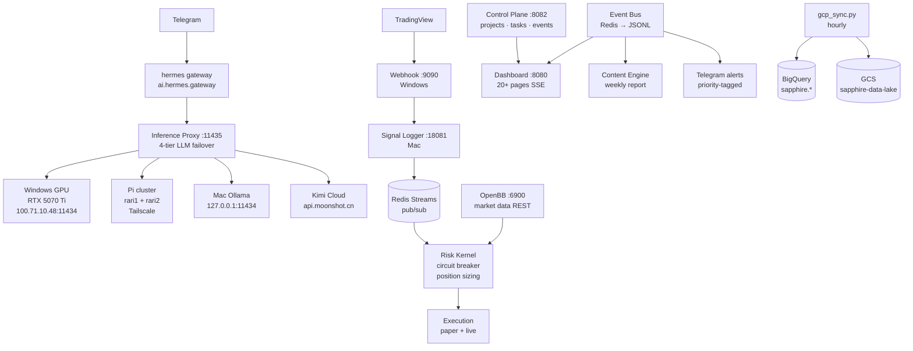

# Sapphire OS

> Autonomous trading · intelligence · content operations


Sapphire is a self-managed operating system for capital allocation and intelligence. It runs continuously across an on-prem cluster (Mac M4 Pro + RTX 5070 Ti Windows + 2 Raspberry Pis) with GCP as the data lake. Human governance is a Telegram heartbeat. Everything else is automated.

> `Net PnL = (edge × trades × capital efficiency) − (fees + slippage + infra + tail losses)`

---

## Architecture


```mermaid
graph TD
    TG[Telegram] --> HG[hermes gateway\n ai.hermes.gateway]
    HG --> IP[Inference Proxy :11435\n 4-tier LLM failover]

    IP --> GPU[Windows GPU\n RTX 5070 Ti\n 100.71.10.48:11434]
    IP --> PI[Pi cluster\n rari1 + rari2\n Tailscale]
    IP --> MAC[Mac Ollama\n 127.0.0.1:11434]
    IP --> KC[Kimi Cloud\n api.moonshot.cn]

    TV[TradingView] --> WH[Webhook :9090\n Windows]
    WH --> SL[Signal Logger :18081\n Mac]
    SL --> RD[(Redis Streams\n pub/sub)]
    RD --> RK[Risk Kernel\n circuit breaker\n position sizing]
    RK --> EX[Execution\n paper + live]

    EB[Event Bus\n Redis → JSONL] --> DS[Dashboard :8080\n 20+ pages SSE]
    EB --> CE[Content Engine\n weekly report]
    EB --> TA[Telegram alerts\n priority-tagged]

    GS[gcp_sync.py\n hourly] --> BQ[(BigQuery\n sapphire.*)]
    GS --> GCS[(GCS\n sapphire-data-lake)]

    CP[Control Plane :8082\n projects · tasks · events] --> DS
    OB[OpenBB :6900\n market data REST] --> RK
```

```
Hardware topology
─────────────────
Mac M4 Pro (100.67.171.79) ── commander, all LaunchAgents
  inference-proxy :11435 · signal-logger :18081 · dashboard :8080
  control-plane :8082 · hermes gateway (Telegram) · OpenBB :6900 · Redis :6379

Windows (100.71.10.48) ─── GPU node
  Ollama :11434 (28 models, RTX 5070 Ti 16 GB)
  TradingView webhook :9090 · telemetry-dashboard :3001

Pi rari1 (100.120.191.1) ── T2 inference (Tailscale)
Pi rari2 (100.87.225.89) ── T2 inference (Tailscale)
  Each: nemotron-mini · gemma2:2b · smollm2:1.7b · qwen2.5:0.5b

GCP ─── data lake
  BigQuery: tho-ai-agent.sapphire.{signals,predictions,market_regime,threats,…}
  GCS: sapphire-data-lake/raw/<source>/YYYY-MM-DD/
```

---

## Module Reference

| Path | Type | Description |
|------|------|-------------|
| `lib/core/` | library | Risk kernel, circuit breaker, position sizing, event bus, pubsub, logging, models |
| `lib/agents/` | library | OpenClaw/NemoClaw dispatch, orchestrator, runtime policy, token governor |
| `lib/analytics/` | library | Correlation, CPCV, regime detection, VPIN, backtest engine, risk engine, liquidation |
| `lib/chain/` | library | On-chain intelligence: regime, funding, OI, TVL, stablecoin supply, whale flow |
| `lib/content/` | library | Weekly report generator, publishers (Substack/X/LinkedIn/Typefully), quality gate |
| `lib/intel/` | library | Lead enrichment, threat feed aggregation |
| `lib/payments/` | library | x402 HTTP 402 micropayment middleware (Flask + raw-socket gates, EVM signatures) |
| `lib/portfolio/` | library | Robinhood integration, portfolio state |
| `lib/telegram/` | library | Telegram bot framework, command handlers |
| `lib/trading/` | library | Strategy runtime, signal enhancer, self-optimizer |
| `services/alpha/` | service | Trading engine + signal logger [Mac :18081] |
| `services/aster/` | service | Aster DEX bot — Solana perps (paused) |
| `services/control-plane/` | service | PM hub: projects, tasks, events, Kimi bridge [Mac :8082] |
| `services/dashboard/` | service | Flask dashboard [Mac :8080] — SSE stream, 20+ pages, basic-auth |
| `services/hyperliquid/` | service | Hyperliquid L1 bot (stub) |
| `services/inference-proxy/` | service | 4-tier LLM failover [Mac :11435] + x402 gate |
| `services/intelligence/` | service | Daily brief generator, chain refresh |
| `services/pipeline/` | service | GCP sync: events → GCS/BigQuery (hourly watermark) |
| `services/scout-sandbox/` | service | External-collaborator least-privilege sandbox |
| `services/webhook/` | service | TradingView webhook receiver [Windows :9090] |
| `plugins/claw-sapphire/` | plugin | 32 tools + 10 libs + 2 hooks for claw-code runtime |
| `pine/` | Pine Script | 5 TradingView strategies (v1–v3 Ultra, multi-symbol screener) |
| `skills/` | skills | 11 Claude Code skill directories |
| `data/` | state | Runtime JSONL streams, paper portfolio, registries |
| `infra/launchagents/` | infra | 20 macOS LaunchAgent plists |
| `docs/` | docs | Architecture overview, setup guides, security audit |

---

## Trading Strategies

Five Pine Script strategies in `pine/`, targeting 80%+ win rate:

| Strategy | File | Description |
|----------|------|-------------|
| Pair Trading v1 | `PairTrading_AI_System_v1.pine` | Baseline Z-score mean reversion |
| Pair Trading v2 | `PairTrading_AI_System_v2_Strategy.pine` | v1 + neural network signal overlay |
| Pair Trading v3 Ultra | `PairTrading_AI_System_v3_Ultra.pine` | Kalman filtering, regime detection, Kelly position sizing |
| Multi-Symbol Screener | `PairTrading_MultiSymbol_Screener.pine` | Scans ETH/BTC, SOL/BTC, ZEC/BTC, HYPE/USDT simultaneously |
| Sapphire Mac | `Sapphire_Strategy_Mac.pine` | Mac-optimized execution variant |

**Live signal pipeline:** TradingView → Windows webhook (:9090) → Mac signal-logger (:18081) → Redis → risk kernel → paper/live execution.

**Prediction engine** (`plugins/claw-sapphire/tools/predict.py`): 6-factor TA (RSI, MACD, Bollinger Bands, MA, ATR, volume) + Kronos ML. Scored nightly against realized prices.

| Asset | Accuracy (24 scored predictions) |
|-------|----------------------------------|
| BTC   | 75% |
| ETH   | 62% |
| SOL   | 38% |
| Overall | 58% |

**Paper portfolio:** $100K notional, ATR-based stop-loss/take-profit (1.67:1 R:R), 10% position sizing. Runs in parallel with live signals.

---

## Analytics Engine

`lib/analytics/` implements a professional quant stack:

| Module | Description |
|--------|-------------|
| `cpcv.py` | Combinatorial Purged Cross-Validation — prevents backtest overfitting |
| `regime.py` | GMM-based market regime detection (BULL / BEAR / TRANSITION / NEUTRAL) |
| `vpin.py` | Volume-Synchronized Probability of Informed Trading — order flow toxicity |
| `backtest_engine.py` | Full vectorized backtest with walk-forward windows |
| `risk_engine.py` | Kelly-informed sizing, Sortino/Calmar, deflated Sharpe, max drawdown |
| `correlation.py` | Rolling cross-asset correlation, broken-correlation alerts |
| `liquidation.py` | Liquidation cascade risk estimation |
| `performance.py` | PnL attribution, factor decomposition |
| `indicators.py` | RSI, MACD, Bollinger Bands, ATR, MA — also used by plugin tools |
| `sentiment.py` | Fear/greed aggregation from multiple feeds |

**On-chain regime** (`lib/chain/intelligence.py`): aggregates funding rates, open interest, TVL, stablecoin supply, and whale flow into a single regime score. Snapshots written to `data/chain/` every 15 minutes and synced to BigQuery.

---

## Data Sources

| Provider | Library | Data |
|----------|---------|------|
| DeFiLlama | REST | TVL, protocol metrics |
| CoinGlass | `lib/chain/coinglass.py` | Options, liquidations, OI |
| CoinMetrics | REST | On-chain fundamentals |
| Dune Analytics | `lib/chain/dune.py` | Custom SQL queries |
| Whale Alert | `lib/chain/whale_alert.py` | Large transaction tracking |
| Santiment | `lib/chain/santiment.py` | Social + on-chain intelligence |
| CoinAPI | `lib/chain/coinapi.py` | OHLCV + reference data |
| BGGeometrics | `lib/chain/bgeometrics.py` | On-chain metrics |
| OpenBB | REST (:6900) | Equity, crypto OHLCV — use REST, SDK is broken |
| CoinGecko | REST | Market caps, price feeds |
| Hyperliquid | WebSocket | L1 perp order book |
| FRED | REST | Macro indicators (requires API key) |
| CISA / NVD | REST | Vulnerability intelligence (threat-intel-sweep) |
| GitHub | REST | Starred repo sync, trending discovery |

---

## Inference Proxy

`services/inference-proxy/app.py` — 4-tier failover with OpenAI-compatible output across all tiers.

| Tier | Host | Models | Notes |
|------|------|--------|-------|
| T1 — Windows GPU | 100.71.10.48:11434 | hermes3:8b, gemma4, deepseek-r1:14b, qwen3:14b, qwen2.5:32b | Uses native `/api/chat` (not `/v1/`) |
| T2 — Pi cluster | rari1/rari2:11434 | nemotron-mini, qwen2.5:0.5b, gemma2:2b, smollm2:1.7b | Lightweight only |
| T3 — Mac Ollama | 127.0.0.1:11434 | Any model | ~90 s CPU inference, last resort |
| T4 — Kimi Cloud | api.moonshot.cn | kimi-cloud | Non-sensitive only; sensitivity classifier gates |

**Model aliases:** `fast`/`quick` → nemotron-mini · `auto` → hermes3:8b · `deep` → qwen3:14b · `code` → gemma4 · `reason` → deepseek-r1:14b · `large` → qwen2.5:32b · `kimi` → kimi-cloud

**GPU benchmarks (RTX 5070 Ti, 2026-04-14):**

| Model | Tokens/s | VRAM |
|-------|----------|------|
| nemotron-mini (4B) | 232 | 2.7 GB |
| hermes3 (8B) | 118 | 4.7 GB |
| gemma4 | 154 | 9.0 GB |
| deepseek-r1 (14B) | 80 | 9.0 GB |
| qwen3.5 (9B) | 107 | 6.6 GB |
| qwen3 (14B) | 81 | 9.3 GB |
| qwen2.5 (32B) | 2.7 | 19.9 GB |
| nemotron-cascade-2 (MoE) | 16 | 22.6 GB |

**Endpoints:** `/v1/chat/completions` · `/v1/models` · `/health` · `/metrics`

---

## Hermes Agent (Telegram Bot)

hermes-agent (NousResearch) — always-on Telegram gateway. Installed at `~/.hermes/`.

- Model: hermes3:8b via inference-proxy
- 14 skills in `~/.hermes/skills/sapphire/`: cyber-intel, inference-tier, kimi-delegate, macro-data, paper-trading, regional-intel, repo-discovery, system-health, system-ops, tho-operations, threat-intel, trading-analysis, trading-brain, trading-signals
- Restart: `~/.local/bin/hermes gateway restart`

---

## Content Engine

`lib/content/` — 6-stage automated research-to-publish pipeline:

1. **Signal collection** — event bus aggregation from all services
2. **Report generation** (`report_generator.py`) — weekly synthesis from signals + chain data
3. **Quality gate** (`quality.py`) — automated review before promotion
4. **Formatting** (`formatters.py`) — platform-specific rendering
5. **Publishing** (`auto_publish.py`) — promotes drafts from `data/content/` to `ready/`
6. **Multi-platform push** — Substack, X, LinkedIn, Typefully

Scheduled weekly via `com.sapphire.content-engine` LaunchAgent. Also invocable: `python3 -m lib.content generate`.

---

## Sapphire Plugin (claw-code, 32 tools)

`plugins/claw-sapphire/` — all tools invoked via stdin JSON.

**Registered in Claude Code (7):** `dispatch` · `verify` · `budget` · `state` · `status` · `notify` · `market`

**Intel / analytics (9):** `threat_intel` · `starred_repos` · `vote_monitor` · `health_check` · `watchdog` · `digest` · `research` · `events` · `qa_aware_factory`

**Trading (9):** `predict` · `predict_kronos` · `signal_generator` · `paper_trader` · `crypto_portfolio` · `backtest` · `market_sentiment` · `trading_brain` · `macro_data`

**Other (7):** `lead_engine` · `lead_enrich` · `lumo` · `lumo_research` · `tho_intel` · `solana_wallet` · `kronos_predict` (legacy)

**Shared libs (10):** `technical_analysis` · `nemotron` · `quant_analysis` · `router` · `runtime_policy` · `token_governor` · `sensitivity_classifier` · `market_data` · `nvidia_agents` · `budget` (module)

---

## Dashboard

`services/dashboard/` — Flask, basic-auth, SSE event stream, 10 s cached fetchers.

**Pages (20+):**

| Page | Route | Description |
|------|-------|-------------|
| Overview | `/` | System status + live metrics |
| Architecture | `/architecture` | Live system topology |
| Intelligence | `/intelligence` | Chain analysis + AI summaries |
| Signals | `/signals` | Trading signal feed |
| Predictions | `/predictions` | Kronos ML forecast history |
| Analytics | `/analytics` | Correlation, performance charts |
| Chain | `/chain` | On-chain overview (funding, OI, TVL) |
| Risk | `/risk` | Risk dashboard + backtest |
| SOC | `/soc` | Security Operations Center |
| Agents | `/agents` | AI agent status + history |
| Content | `/content` | Draft management |
| Infrastructure | `/infrastructure` | Service health matrix |
| Metrics | `/metrics` | Inference proxy counters |
| Benchmarks | `/benchmarks` | Kadima Labs AI benchmark |
| Command Deck | `/command-deck` | Direct service control |
| Control | `/control` | Control plane bridge |
| Health Status | `/health-status` | Per-service health monitor |
| System | `/system` | System resource usage |
| Organization | `/organization` | Team/project view |
| Sapphire Book | `/sapphire-book` | Trading journal |
| Production | `/production-readiness` | Pre-flight checklist |
| Logs | `/logs` | Structured log viewer |

---

## Security

Sapphire is private-by-default. Key controls:

| Control | Implementation |
|---------|----------------|
| Network perimeter | Tailscale mesh — all inter-node traffic; no open ports to internet |
| Auth | Basic-auth on dashboard; `CONTROL_PLANE_TOKEN` on control-plane (fails closed at 503) |
| Secrets | GCP Secret Manager (prod); `~/.sapphire/secrets.env` (mode 0600, never in plists) |
| Sensitivity classifier | `sensitivity_classifier.py` — regex blocks api_key/password/JWT/SSN/CC from reaching Kimi Cloud |
| x402 paywall | HTTP 402 gate on inference-proxy; EVM signature verification (`lib/payments/`) |
| Kill switches | Per-service `ENABLED=0` env var; circuit breaker in `lib/core/` |
| Audit trail | All events to `data/system_events.jsonl`; BigQuery for long-term retention |
| Prompt injection | `sensitivity_classifier` + hermes handler guards; `docs/prompt-injection-analysis-2026-04-15.md` |
| Dependency scanning | `dependency-security-scan` scheduled task (Wednesday 4 AM) |
| NIST alignment | `docs/nist-alignment.md` — full CSF control map |

See [`docs/opus-audit-2026-04-17.md`](docs/opus-audit-2026-04-17.md) for the full security audit.

---

## Scheduled Routines (20 tasks)

All in `~/.claude/scheduled-tasks/`. Run continuously when Claude Code is open.

| Task | Schedule | Description |
|------|----------|-------------|
| morning-briefing | 8:00 AM | 6-section digest → Telegram |
| trading-research | 5:42 AM | TA predictions + scoring |
| market-pulse | 8/12/4 PM M-F | Signal scan + paper trade stops |
| threat-intel-sweep | 6:30 AM + 2 PM | CISA/NVD vulnerability feed |
| github-discovery | 7:00 AM | Star sync + trending repos |
| tho-production-healthcheck | every 2h | Watchdog |
| tho-test-writer | 11 AM + 11 PM | Coverage growth |
| creative-experimenter | 2:00 AM | Nightly R&D |
| factory-test-guardian | 3 AM + 3 PM | All test suites |
| factory-repo-fixer | every 6h | Auto-fix lint |
| code-quality-sweep | 1:00 PM | Dead code, imports |
| evening-digest | 6:00 PM | Daily summary → Telegram |
| self-improvement | 8:53 PM | Priority recalibration |
| sapphire-ci-monitor | every 3h | Lint + unit tests |
| factory-client-delivery | 10 AM M-F | THO production output |
| vote-monitor-collector | every 4h | DeFi pool snapshots |
| dependency-security-scan | Wed 4 AM | Vuln + secret scan |
| sapphire-weekly-review | Sun 9 AM | Architecture audit |
| lead-generation | daily | Autonomous outreach |
| pull-gcp-secrets | on-demand | GCP secret sync |

---

## Revenue Pipelines

| Pipeline | Status | Description |
|----------|--------|-------------|
| Trading | Active (paper) | Autonomous signal generation; live execution pending live API keys |
| THO (The Honest Operator) | Active | Client PM deliverables via control-plane; Cloud Run deployment |
| Elite Net | Active | Outreach + lead engine (`lead_engine.py`, `lead_enrich.py`) |
| x402 Inference | Implemented | HTTP 402 paywall on inference-proxy; EVM payment verification |
| Content / Substack | Active | Weekly automated report → multi-platform publish |

---

## Quick Start

```bash
# Requirements: Python 3.11+, ruff, Redis, Ollama, Node 18+

# 1. Clone and install deps
pip install -r services/alpha/requirements.txt
pip install -r services/dashboard/requirements.txt

# 2. Set secrets
cp env.example .env
cp .env.integrations.example .env.integrations  # content + chain keys
export AUTH_PASSWORD=sapphire
export TELEGRAM_BOT_TOKEN=<from @BotFather>
export MOONSHOT_API_KEY=<optional, Kimi Cloud fallback>

# 3. Start core services (or use LaunchAgents on Mac)
python3 services/inference-proxy/app.py &                    # :11435
cd services/alpha && python3 -m uvicorn src.signal_logger:app --port 18081 &
cd services/dashboard && python3 app.py &                    # :8080
cd services/control-plane && uvicorn app.main:app --port 8082 &

# 4. Health check
curl -s http://127.0.0.1:11435/health | python3 -m json.tool
curl -s http://127.0.0.1:18081/health

# 5. Run plugin tools (all read stdin JSON)
echo '{"action":"quote","symbol":"BTC/USDT"}' | python3 plugins/claw-sapphire/tools/market.py
echo '{"action":"predict"}'                   | python3 plugins/claw-sapphire/tools/predict.py

# 6. Content engine
python3 -m lib.content generate   # render weekly report
python3 -m lib.content publish    # promote draft → ready/
```

---

## Testing

```bash
# Unit tests (1606 passing, 1 skipped)
/usr/local/bin/python3 -m pytest tests/unit/ --tb=short -q

# Plugin tests (25 tests: budget, router, state, technical_analysis)
/usr/local/bin/python3 -m pytest plugins/claw-sapphire/tests/ -q

# Lint
ruff check .          # E501 ignored; see pyproject.toml
ruff check --fix .    # auto-fix safe issues
```

> **Mac gotcha:** `python3` may resolve to Homebrew 3.14 which lacks pytest. Always use `/usr/local/bin/python3`.

---

## Configuration

| Variable | Required | Description |
|----------|----------|-------------|
| `TELEGRAM_BOT_TOKEN` | Yes | Bot token from @BotFather |
| `TELEGRAM_CHAT_ID` | Yes | Target chat/channel ID |
| `AUTH_PASSWORD` | Yes | Dashboard basic-auth password |
| `SAPPHIRE_CONTROL_API_TOKEN` | Yes | Control-plane token (fails closed at 503 if unset) |
| `MOONSHOT_API_KEY` | No | Kimi Cloud fallback (stored in `~/.sapphire/secrets.env`) |
| `ANTHROPIC_API_KEY` | No | Claude API access |
| `GEMINI_API_KEY` | No | Gemini integration |
| `VIRUSTOTAL_API_KEY` | No | Threat analysis |
| `GOOGLE_APPLICATION_CREDENTIALS` | No | GCP sync (points to ADC JSON) |
| `GOOGLE_CLOUD_PROJECT` | No | GCP project ID (default: `tho-ai-agent`) |
| `OPENCLAW_GATEWAY_URL` | No | OpenClaw agent gateway |
| `ENABLED_VENUES` | No | Active trading venues (e.g. `ASTER;LIGHTER`) |
| `X402_ENABLED` | No | Enable x402 paywall on inference-proxy |
| `PI_RARI1_ENABLED` | No | Route inference requests to Pi rari1 |
| `PI_RARI2_ENABLED` | No | Route inference requests to Pi rari2 |

Content publishing and chain provider keys live in `.env.integrations` (see `.env.integrations.example`).

Production secrets are managed in GCP Secret Manager. Never commit real values.

---

## Research

The `docs/` directory contains 200K+ words of cross-validated research and planning:

| Document | Description |
|----------|-------------|
| [`docs/architecture-overview.md`](docs/architecture-overview.md) | Full module wiring, request lifecycles, data flows |
| [`docs/opus-audit-2026-04-17.md`](docs/opus-audit-2026-04-17.md) | Security audit — source of current hardening |
| [`docs/crypto-integrations-plan.md`](docs/crypto-integrations-plan.md) | x402 + on-chain integration roadmap |
| [`docs/nist-alignment.md`](docs/nist-alignment.md) | NIST CSF control map |
| [`docs/gcp-data-engineering.md`](docs/gcp-data-engineering.md) | Data lake design, BigQuery schema |
| [`docs/kronos-integration-plan.md`](docs/kronos-integration-plan.md) | Kronos ML forecasting architecture |
| [`docs/QUICK_START_GUIDE.md`](docs/QUICK_START_GUIDE.md) | First-run setup |
| [`docs/LOGGING.md`](docs/LOGGING.md) | Event + audit log schema |
| [`docs/setup/`](docs/setup/) | Windows node bringup, Pi networking, Cloudflare DNS |

---

## Satellite Repositories

| Repo | Role |
|------|------|
| `instructkr/claw-code` | Rust agent runtime (orchestrates all plugins) |
| `arigatoexpress/Project-Go-Forward` | THO client PM |
| `arigatoexpress/regional-intel-workbench` | Regional intelligence platform |
| `arigatoexpress/tradingview-mcp` | TradingView MCP server |
| `arigatoexpress/crypto-tax-tracker` | Crypto tax engine |
| `arigatoexpress/cyber-threat-bot` | Threat intel feeds |
| `NousResearch/hermes-agent` | Conversational framework (Telegram bot) |

---

## License

Proprietary — see [`LICENSE`](LICENSE).

All research, strategies, and implementations are private. Do not distribute.
