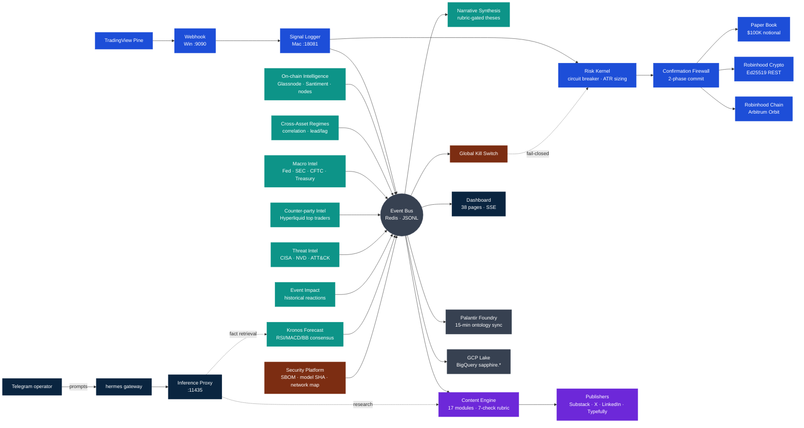
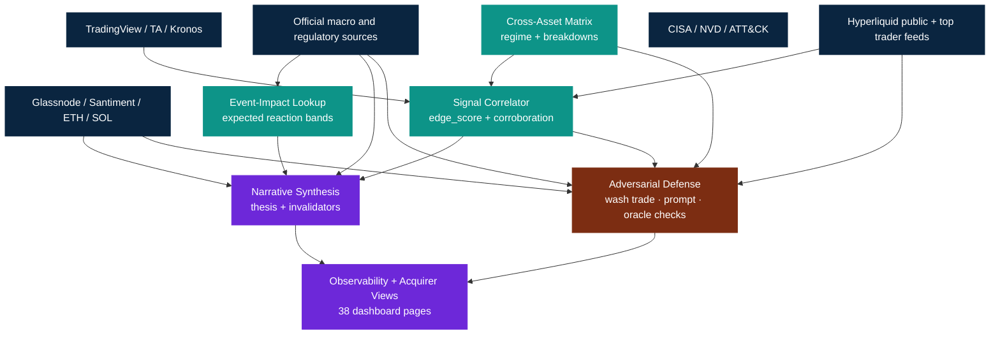
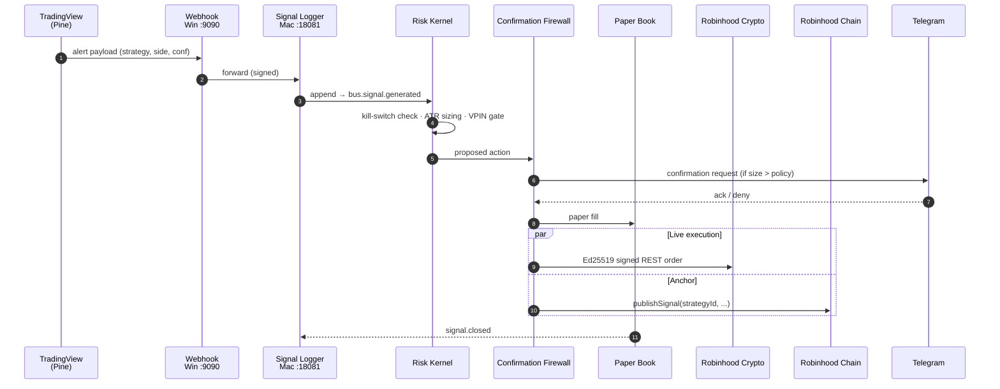
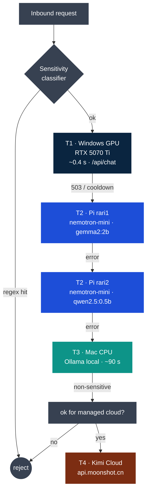
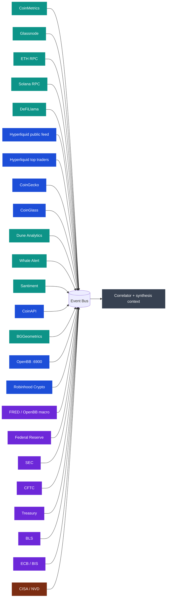
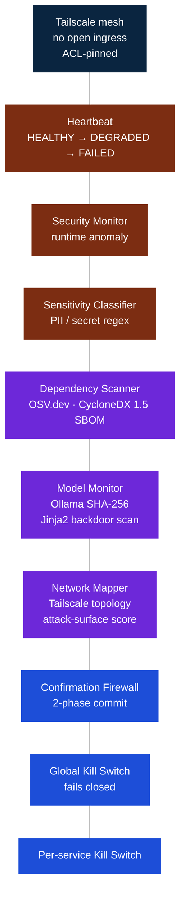
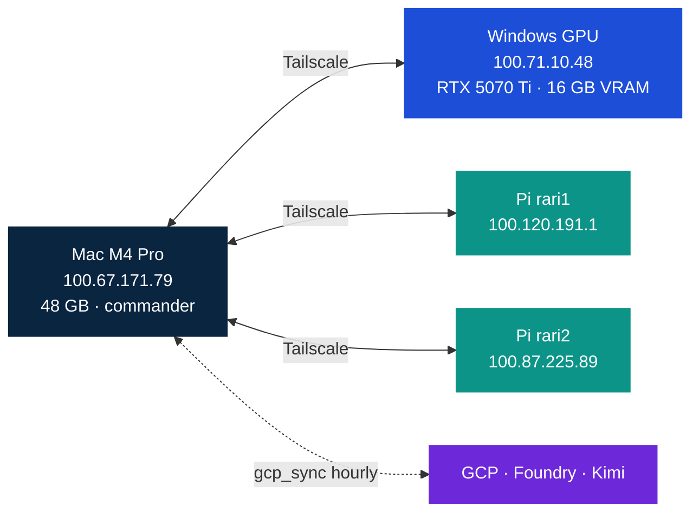

<div align="center">


# Sapphire OS

**A self-sovereign operating system for capital intelligence, autonomous operations, and acquisition-grade diligence.**

[](https://github.com/arigatoexpress/Sapphire/actions/workflows/ci.yml)
[](https://github.com/arigatoexpress/Sapphire/actions/workflows/security.yml)
[](https://github.com/arigatoexpress/Sapphire/actions/workflows/ci.yml)
[](infra/tool-registry.yaml)
[](services/dashboard/templates/pages)
[](scripts/ops/production_readiness_sweep.py)
[](https://www.python.org/)
[](contracts/)
[](infra/tailscale-acl.json)
[](LICENSE)

</div>

---

## Abstract

Sapphire is a continuously-running, mesh-topology operating system that integrates market intelligence, on-chain analytics, adversarial signal defense, macro/regulatory context, threat intelligence, and content production into one agent-mediated control plane. It runs on a four-node Tailscale cluster — an Apple Silicon commander, an RTX 5070 Ti inference node, and two Raspberry Pi edge nodes — and uses Google Cloud Platform as an auditable data lake rather than an uncontrolled runtime dependency. The system is observed through an event bus, steered through operator-gated controls, and documented for acquisition diligence.

The intelligence subsystem now composes deterministic signal correlation, cross-asset regime detection, regulatory/macro calendars, on-chain provider snapshots, Hyperliquid counter-party tracking, historical event-impact lookup tables, and rubric-gated narrative synthesis. The trading subsystem remains behind risk-kernel, confirmation-firewall, dry-run, and kill-switch controls. The inference mesh provides four-tier failover (RTX 5070 Ti GPU -> Raspberry Pi -> Mac CPU -> Kimi Cloud) with a sensitivity classifier that fails closed against PII or secret egress to managed cloud endpoints. The content engine is a research-to-publish pipeline with an institutional quality gate that blocks unsupported performance claims before they reach Substack, X, LinkedIn, or Typefully.

The platform is operated as a research instrument: every routine produces an artifact, every artifact has a verdict, every generated artifact carries provenance, and every verdict feeds a 38-page operational dashboard.

> $$\mathrm{NetPnL} = \underbrace{\sum_{t}\,\mathrm{edge}_t\,\cdot\,\mathrm{capital}_t\,\cdot\,\mathrm{efficiency}_t}_{\text{alpha}} \;-\; \underbrace{\sum_{t}\,\mathrm{fees}_t + \mathrm{slip}_t + \mathrm{infra}_t + \mathrm{tail}_t}_{\text{cost}}$$

---

## Contents

1. [System Architecture](#1-system-architecture)
   - [Tranche 4 Intelligence Layer](#11-tranche-4-intelligence-layer)
2. [Theoretical Foundations](#2-theoretical-foundations)
3. [Trading System](#3-trading-system)
4. [Inference Mesh](#4-inference-mesh)
5. [Data Sources](#5-data-sources)
6. [Security Platform](#6-security-platform)
7. [Content Engine](#7-content-engine)
8. [Smart Contracts](#8-smart-contracts)
9. [Hardware Topology](#9-hardware-topology)
10. [Operational Telemetry](#10-operational-telemetry)
11. [Quick Start](#11-quick-start)
12. [Testing & QA](#12-testing--qa)
13. [Configuration](#13-configuration)
14. [Documentation](#14-documentation)
15. [References](#15-references)
16. [License](#license)

---

## 1. System Architecture

Sapphire is composed of six concerns separated by an event bus. Producers emit typed events; consumers subscribe without coupling. Redis Streams is primary; a JSONL fallback at `data/events/bus.jsonl` survives Redis outages without dropping events.


```mermaid
flowchart LR
    classDef edge       fill:#0A2540,stroke:#0A2540,color:#fff
    classDef trading    fill:#1d4ed8,stroke:#1d4ed8,color:#fff
    classDef intel      fill:#0d9488,stroke:#0d9488,color:#fff
    classDef security   fill:#7c2d12,stroke:#7c2d12,color:#fff
    classDef content    fill:#6d28d9,stroke:#6d28d9,color:#fff
    classDef storage    fill:#374151,stroke:#374151,color:#fff

    Operator[Telegram operator]:::edge
    HermesGateway[hermes gateway]:::edge
    InferenceProxy[Inference Proxy<br/>:11435]:::edge

    TV[TradingView Pine]:::trading
    Webhook[Webhook<br/>Win :9090]:::trading
    SignalLogger[Signal Logger<br/>Mac :18081]:::trading
    RiskKernel[Risk Kernel<br/>circuit breaker · ATR sizing]:::trading
    Confirmation[Confirmation Firewall<br/>2-phase commit]:::trading
    PaperBook[Paper Book<br/>$100K notional]:::trading
    Robinhood[Robinhood Crypto<br/>Ed25519 REST]:::trading
    Chain[Robinhood Chain<br/>Arbitrum Orbit]:::trading

    Bus(((Event Bus<br/>Redis · JSONL))):::storage

    ChainIntel[On-chain Intelligence<br/>Glassnode · Santiment · nodes]:::intel
    CrossAsset[Cross-Asset Regimes<br/>correlation · lead/lag]:::intel
    MacroIntel[Macro Intel<br/>Fed · SEC · CFTC · Treasury]:::intel
    Counterparty[Counter-party Intel<br/>Hyperliquid top traders]:::intel
    Threat[Threat Intel<br/>CISA · NVD · ATT&CK]:::intel
    EventImpact[Event Impact<br/>historical reactions]:::intel
    Predict[Kronos Forecast<br/>RSI/MACD/BB consensus]:::intel
    Narrative[Narrative Synthesis<br/>rubric-gated theses]:::intel

    SecPlatform[Security Platform<br/>SBOM · model SHA · network map]:::security
    KillSwitch[Global Kill Switch]:::security

    ContentEngine[Content Engine<br/>17 modules · 7-check rubric]:::content
    Publishers[Publishers<br/>Substack · X · LinkedIn · Typefully]:::content

    Dashboard[Dashboard<br/>38 pages · SSE]:::edge
    Foundry[Palantir Foundry<br/>15-min ontology sync]:::storage
    GCP[GCP Lake<br/>BigQuery sapphire.*]:::storage

    Operator -->|prompts| HermesGateway --> InferenceProxy
    TV --> Webhook --> SignalLogger --> RiskKernel --> Confirmation
    Confirmation --> PaperBook
    Confirmation --> Robinhood
    Confirmation --> Chain

    SignalLogger --> Bus
    ChainIntel --> Bus
    CrossAsset --> Bus
    MacroIntel --> Bus
    Counterparty --> Bus
    Threat --> Bus
    EventImpact --> Bus
    Predict --> Bus
    SecPlatform --> Bus

    Bus --> Dashboard
    Bus --> Narrative
    Bus --> ContentEngine --> Publishers
    Bus --> Foundry
    Bus --> GCP
    Bus --> KillSwitch -.fail-closed.-> RiskKernel

    InferenceProxy -.fact retrieval.-> Predict
    InferenceProxy -.research.-> ContentEngine
```

**At a glance**

| Surface | Count | Detail |
|---|---:|---|
| Passing tests | **6,287+** | 5,797+ unit · 490 plugin (`python scripts/ops/test_inventory.py --check-readme`) |
| Test files | **355+** | `tests/unit/` and `plugins/claw-sapphire/tests/` |
| Dashboard pages | **38** | Flask + SSE, basic-auth, observability, cross-asset, diligence, threat-intel, dossier pages |
| Quant strategies | **7** | `lib/analytics/strategies.py` |
| Pine strategies | **5** | `pine/standalone/` |
| Plugin tools (registered · internal · deprecated) | **7 · 59 · 1** | 67 total entries in `infra/tool-registry.yaml` |
| LaunchAgent definitions | **34** | Active plists plus service-level templates; runtime loading remains operator-controlled |
| Product docs | **19** | `docs/products/`, including Tranche 4 buyer-facing surfaces |
| Hermes Telegram skills | **16** | `~/.hermes/skills/sapphire/`, audited in `infra/hermes-sapphire-skills.yaml` |
| Smart contracts | **2** | `contracts/*.sol` |
| Inference tiers | **4 + 2** | GPU · Pi · Mac · Kimi Cloud, plus bounded Gemini OODA and narrative synthesis lanes |
| Content publishers | **4** | Substack · X · LinkedIn · Typefully |
| Intelligence/data feeds | **20+** | market, on-chain, macro/regulatory, threat, counter-party, and internal signal feeds |
| Production-readiness sweep | **0 FAIL** | `scripts/ops/production_readiness_sweep.py --no-external` at Tranche 4 closeout |

### 1.1 Tranche 4 Intelligence Layer

Tranche 4 turns Sapphire from a signal collector into a compound intelligence system. Scores, regimes, macro calendars, on-chain heat, smart-money movement, expected historical reactions, and adversarial telemetry now converge into a narrative context block that can be inspected, tested, and buyer-reviewed.


```mermaid
flowchart TB
    classDef source fill:#0A2540,stroke:#0A2540,color:#fff
    classDef model fill:#0d9488,stroke:#0d9488,color:#fff
    classDef guard fill:#7c2d12,stroke:#7c2d12,color:#fff
    classDef output fill:#6d28d9,stroke:#6d28d9,color:#fff

    TV[TradingView / TA / Kronos]:::source
    HL[Hyperliquid public + top trader feeds]:::source
    Macro[Official macro and regulatory sources]:::source
    Chain[Glassnode / Santiment / ETH / SOL]:::source
    Threat[CISA / NVD / ATT&CK]:::source

    Corr[Signal Correlator<br/>edge_score + corroboration]:::model
    Regime[Cross-Asset Matrix<br/>regime + breakdowns]:::model
    Impact[Event-Impact Lookup<br/>expected reaction bands]:::model
    Narrative[Narrative Synthesis<br/>thesis + invalidators]:::output
    Adv[Adversarial Defense<br/>wash trade · prompt · oracle checks]:::guard
    Obs[Observability + Acquirer Views<br/>38 dashboard pages]:::output

    TV --> Corr
    HL --> Corr
    Macro --> Impact
    Macro --> Narrative
    Chain --> Narrative
    Regime --> Corr
    Corr --> Narrative
    Impact --> Narrative

    Corr --> Adv
    Regime --> Adv
    Macro --> Adv
    Chain --> Adv
    HL --> Adv

    Narrative --> Obs
    Adv --> Obs
```

| Surface | Primary modules | Output | Safety posture |
|---|---|---|---|
| Signal correlation | `lib/correlator/`, `services/correlator/` | `edge_score`, corroboration, divergent sources | Read-only adapters, capped fan-in, provenance-stamped JSONL |
| Narrative synthesis | `lib/synthesis/`, `services/synthesis/` | `NarrativeThesis` with evidence, counter-thesis, invalidators | Dry-run default; live requires `SAPPHIRE_NARRATIVE_LIVE=1`; rubric-gated publish |
| Cross-asset regimes | `lib/cross_asset/`, `services/cross_asset/` | Correlation matrix, regime label, breakdown events | Cache-first, no live calls in tests, <=24 assets |
| Macro intelligence | `lib/macro/`, `services/macro_intel/` | Official-source events and forward calendar | Feed caps, source URLs retained, no LLM parser |
| On-chain intelligence | `lib/chain/aggregator.py`, `services/onchain_intel/` | Heat score and provider snapshots for BTC/ETH/SOL | Per-provider live env gates and caps |
| Event-impact model | `lib/event_impact/`, `services/event_impact/` | Historical reaction bands by event type and horizon | Honest wide bands for small samples; dry-run publish by default |
| Counter-party intelligence | `lib/counterparty/`, `services/counterparty/` | Smart-money consensus from public Hyperliquid data | Public-data only, read-only, no wallet keys |
| Adversarial defense | `lib/security/adversarial_*`, `services/adversarial/` | `adversarial.detection` telemetry | Flag-only by default; quarantine requires opt-in |

---

## 2. Theoretical Foundations

The trading subsystem is intentionally biased toward tail-aware ratios and leakage-resistant validation. We treat every backtest as a multiple-comparisons experiment and deflate naïve Sharpe accordingly.

### 2.1 Risk-adjusted return

For a return series $\{r_t\}$ with risk-free rate $r_f$ and downside set $\mathcal{D}=\{t : r_t < r_f\}$:

$$\mathrm{Sortino} \;=\; \frac{\mathbb{E}[r_t] - r_f}{\sigma_d}, \qquad \sigma_d \;=\; \sqrt{\frac{1}{|\mathcal{D}|} \sum_{t\in\mathcal{D}} (r_t - r_f)^2}$$

$$\mathrm{Calmar} \;=\; \frac{\mathrm{CAGR}}{|\mathrm{MaxDD}|}$$

We optimise primarily on Sortino and Calmar; Sharpe is reported but never used as a selection criterion in isolation.

### 2.2 Deflated Sharpe Ratio

To control for the multiple-testing inflation produced by sweeping a strategy grid, we compute the Deflated Sharpe of [Bailey & López de Prado, 2014]:

$$\mathrm{DSR} \;=\; \Phi\!\left(\;\sqrt{N-1}\,\frac{\widehat{SR} - SR_0}{\sqrt{1 - \gamma_3 \widehat{SR} + \frac{\gamma_4 - 1}{4}\widehat{SR}^2}}\;\right)$$

where $\gamma_3, \gamma_4$ are the skewness and kurtosis of the returns and $SR_0$ is the threshold corrected for the number of trials. Implemented in [`lib/analytics/deflated_sharpe.py`](lib/analytics/deflated_sharpe.py).

### 2.3 Combinatorial Purged Cross-Validation (CPCV)

Time-series K-fold leakage is fixed via [López de Prado, 2018] CPCV with embargo: train indices that overlap the labelling horizon of any test sample are purged, and a configurable embargo $h$ removes the post-test boundary. Implemented in [`lib/analytics/cpcv.py`](lib/analytics/cpcv.py).

### 2.4 Volume-synchronised Probability of Informed Trading (VPIN)

Toxicity of order flow per [Easley, López de Prado & O'Hara, 2012] over equal-volume buckets:

$$\mathrm{VPIN}_\tau \;=\; \frac{1}{n}\sum_{i=\tau-n+1}^{\tau} \frac{\bigl|V_i^{B} - V_i^{S}\bigr|}{V}$$

VPIN gates entry sizing on regime-shift days.

### 2.5 Regime detection

A two-state Gaussian Mixture is fit jointly on log-realised-volatility and trend strength, with EM and BIC selection:

$$p(\mathbf{x}) \;=\; \sum_{k=1}^{K}\pi_k\,\mathcal{N}(\mathbf{x};\boldsymbol{\mu}_k,\boldsymbol{\Sigma}_k)$$

Regimes feed `RegimeAwareRSI` and gate the ensemble strategy `SapphireComposite`. Implemented in [`lib/analytics/regime.py`](lib/analytics/regime.py).

### 2.6 Capital allocation

Position sizing is a fractional-Kelly cap with a hard upper bound:

$$f^{*} \;=\; \min\!\left(\,f_\mathrm{cap},\; \lambda\cdot\frac{\mu}{\sigma^{2}}\,\right), \qquad f_\mathrm{cap}=0.10,\; \lambda=0.5$$

Stops and targets are ATR-scaled with a 1.67 : 1 reward-to-risk ratio.

---

## 3. Trading System

### 3.1 Strategy library

| Strategy | Hypothesis | Key signal | Module |
|---|---|---|---|
| `RegimeAwareRSI`        | RSI mean reversion is regime-conditional | RSI · GMM regime | [`strategies.py`](lib/analytics/strategies.py) |
| `FundingRateContrarian` | Crowded perps fund pay reverts at extremes | Funding skew z-score | [`strategies.py`](lib/analytics/strategies.py) |
| `CorrelationBreakout`   | Pair-wise correlation breaks precede trends | Rolling $\rho$ regime | [`strategies.py`](lib/analytics/strategies.py) |
| `MultiTFMomentum`       | Multi-timeframe alignment compounds edge | 1h · 4h · 1d momentum | [`strategies.py`](lib/analytics/strategies.py) |
| `SapphireComposite`     | Regime-weighted ensemble dominates any single | Convex combination | [`strategies.py`](lib/analytics/strategies.py) |
| `Strategy` (base)       | Abstract runtime + parameter registry | — | [`strategies.py`](lib/analytics/strategies.py) |
| `StrategyParams`        | Typed parameter schema | — | [`strategies.py`](lib/analytics/strategies.py) |

Five additional Pine strategies live under [`pine/standalone/`](pine/) and produce TradingView webhook payloads.

### 3.2 Pipeline


```mermaid
sequenceDiagram
    autonumber
    participant TV as TradingView<br/>(Pine)
    participant WH as Webhook<br/>Win :9090
    participant SL as Signal Logger<br/>Mac :18081
    participant RK as Risk Kernel
    participant CF as Confirmation Firewall
    participant Book as Paper Book
    participant RH as Robinhood Crypto
    participant Chain as Robinhood Chain
    participant TG as Telegram

    TV->>WH: alert payload (strategy, side, conf)
    WH->>SL: forward (signed)
    SL->>RK: append → bus.signal.generated
    RK->>RK: kill-switch check · ATR sizing · VPIN gate
    RK->>CF: proposed action
    CF->>TG: confirmation request (if size > policy)
    TG-->>CF: ack / deny
    CF->>Book: paper fill
    par Live execution
        CF->>RH: Ed25519 signed REST order
    and Anchor
        CF->>Chain: publishSignal(strategyId, ...)
    end
    Book-->>SL: signal.closed
```

### 3.3 Risk and validation

Three independent gates protect capital before any external action:

1. **Global kill switch** ([`lib/core/kill_switch.py`](lib/core/kill_switch.py)) — fails closed; one toggle disarms execution.
2. **Confirmation firewall** ([`lib/core/confirmation_firewall.py`](lib/core/confirmation_firewall.py)) — two-phase-commit gate on any state-mutating action; size-based escalation to Telegram.
3. **Decision engine** ([`lib/core/decision_engine.py`](lib/core/decision_engine.py)) — ranks and explains every autonomous decision before it executes; emits structured rationale to the bus.

Backtests run under CPCV with embargo and report DSR; walk-forward results land in `data/backtests/`.

### 3.4 Empirical accuracy

Forward-tested 6-factor TA predictions, scored at horizon T+24h (live snapshot, $n=36$ scored of $42$ recorded):

| Asset | Scored | Correct | Accuracy |
|---|---:|---:|---:|
| **BTC** | 12 | 10 | **83.3 %** |
| ETH | 12 | 6 | 50.0 % |
| SOL | 12 | 6 | 50.0 % |
| **Overall** | **36** | **22** | **61.1 %** |

Directional breakdown reveals the model's strongest edge in non-bearish regimes:

| Direction | Accuracy |
|---|---:|
| Bullish | 73.7 % |
| Neutral | 77.8 % |
| Bearish | 12.5 % |

The asymmetry is statistically distinguishable from the bullish rate (Fisher's exact $p = 0.0085$, two-proportion $z = -2.922$). Root cause is structural: four of five strategies in `lib/analytics/strategies.py` have no `short` branch, and `plugins/claw-sapphire/tools/internal/predict.py` weights `MA↓` at 2.0 (vs. 0.5–1.5 for other single-component bear factors), flipping `net` to bearish even when the underlying ensemble is net-bullish. Full evidence and a layered fix are tracked in [`docs/research/bearish-direction-asymmetry-2026-04-26.md`](docs/research/bearish-direction-asymmetry-2026-04-26.md).

---

## 4. Inference Mesh

The inference proxy is a stateless threaded HTTP server that exposes `/v1/chat/completions`, `/v1/models`, `/health`, and `/metrics`. Routing policy:


```mermaid
flowchart TD
    classDef tier1 fill:#0A2540,color:#fff,stroke:#0A2540
    classDef tier2 fill:#1d4ed8,color:#fff,stroke:#1d4ed8
    classDef tier3 fill:#0d9488,color:#fff,stroke:#0d9488
    classDef tier4 fill:#7c2d12,color:#fff,stroke:#7c2d12
    classDef gate  fill:#374151,color:#fff,stroke:#374151

    Req[Inbound request]:::gate
    Sens{Sensitivity<br/>classifier}:::gate
    SafeFor4[ok for managed cloud?]:::gate

    T1[T1 · Windows GPU<br/>RTX 5070 Ti<br/>~0.4 s · /api/chat]:::tier1
    T2A[T2 · Pi rari1<br/>nemotron-mini · gemma2:2b]:::tier2
    T2B[T2 · Pi rari2<br/>nemotron-mini · qwen2.5:0.5b]:::tier2
    T3[T3 · Mac CPU<br/>Ollama local · ~90 s]:::tier3
    T4[T4 · Kimi Cloud<br/>api.moonshot.cn]:::tier4

    Req --> Sens
    Sens -- regex hit --> Refused((reject)):::gate
    Sens -- ok --> T1
    T1 -- 503 / cooldown --> T2A
    T2A -- error --> T2B
    T2B -- error --> T3
    T3 -- non-sensitive --> SafeFor4
    SafeFor4 -- yes --> T4
    SafeFor4 -- no --> Refused
```

| Tier | Host | Latency (p50) | Notes |
|---|---|---:|---|
| **T1 · Windows GPU** | `100.71.10.48:11434` | **0.4 s** | RTX 5070 Ti, 16 GB VRAM, 28 models loaded. Native `/api/chat` (Windows Ollama `/v1/` returns empty). |
| **T2 · Pi rari1**     | `100.120.191.1:11434` | 2–5 s | Pi-safe models only: `nemotron-mini`, `gemma2:2b`, `smollm2:1.7b`, `qwen2.5:0.5b`. |
| **T2 · Pi rari2**     | `100.87.225.89:11434`  | 2–5 s | Same roster as `rari1`. |
| **T3 · Mac CPU**      | `127.0.0.1:11434`      | ~90 s | Failsafe; only used when GPU and Pis are down. |
| **T4 · Kimi Cloud**   | `api.moonshot.cn`     | 2–6 s | Sensitivity classifier gates. Token budget enforced per dispatch. |

**Model aliases** — `fast` → nemotron-mini · `balanced` → hermes3:8b · `code` → gemma4 · `reason` → deepseek-r1:14b · `qwen-reason` → qwen3.5:9b · `deep` → qwen3:14b · `qwen3.6` → qwen3.6:27b · `cascade`/`moe` → nemotron-cascade-2 · `large` → qwen2.5:32b · `kimi` → kimi-cloud.

**Sensitivity classifier** ([`plugins/claw-sapphire/lib/sensitivity_classifier.py`](plugins/claw-sapphire/lib/sensitivity_classifier.py)) blocks API keys, JWTs, SSNs, credit-card patterns, and known secret formats before any T4 egress.

### 4.1 Bounded Gemini OODA lane (AI complement)

The 4-tier mesh handles every routine inference. For the small set of prompts where a managed model adds value, the [`gemini_ooda`](plugins/claw-sapphire/tools/gemini_ooda.py) plugin tool is the audited door — *complement, not replace*.

| Layer | Default | Live gate | Cap |
|---|---|---|---|
| Mode | `dry-run` (deterministic mock) | `SAPPHIRE_GEMINI_LIVE=1` env flag | n/a |
| Sensitivity | passes the same regex classifier as T4 Kimi | identical `is_sensitive` block | n/a |
| API key | not read | `GEMINI_API_KEY` from `~/.sapphire/secrets.env` | not echoed |
| Per-call output | n/a | `MAX_OUTPUT_TOKENS_HARD = 4_096` | hard fail-closed |
| Per-hour calls | n/a | `MAX_CALLS_PER_HOUR = 8` | hard fail-closed |
| Per-month tokens | n/a | `MAX_TOKENS_PER_MONTH = 500_000` | hard fail-closed |
| Cache | TTL configurable | `~/.cache/sapphire/gemini_ooda/` | yes |

The dashboard surfaces a read-only OODA preview at [`/api/gemini-ooda`](services/dashboard/app.py) and renders an Observe / Orient / Decide / Act panel on `/sovereign-thesis`. Operator-side use is documented in [`docs/ops/gemini-ooda-synthesizer-runbook.md`](docs/ops/gemini-ooda-synthesizer-runbook.md). Hermes-side use is documented in `~/.hermes/skills/sapphire/gemini-ooda/SKILL.md` and registered in [`infra/hermes-sapphire-skills.yaml`](infra/hermes-sapphire-skills.yaml).

### 4.2 Production-readiness posture

Sapphire is operated under a strict "no-spend, local-CI-as-merge-evidence" posture:

- **Self-hosted GitHub runner.** Hosted Actions are gated behind `vars.SAPPHIRE_RUNNER`; commits intentionally land with `[skip ci]` so the GitHub-paid runners never fire. The full local CI (`scripts/ops/local_ci_verify.py --verbose`) is the merge gate, including README test-inventory drift.
- **Production-readiness sweep.** [`scripts/ops/production_readiness_sweep.py`](scripts/ops/production_readiness_sweep.py) probes repo state, org no-spend workflow gates, satellite merge posture, LaunchAgent definitions, local HTTP endpoints, the kill switch, autonomy-audit redaction, routine soaks, GitHub PR/issue queues, GCP/Vertex inventory, the Workspace threat-hygiene template, the Telegram bot, the Gemini live readiness probe, and bounded GCS/BigQuery write probes. The Tranche 4 handoff sweep in `--no-external` mode had `0` FAIL rows; remaining WARN rows are manual/live-readiness gates, not failed local invariants.
- **Hermes runtime guard.** The Sapphire runtime quick-exec command guard is promoted to the live `ai.hermes.gateway` LaunchAgent with `SAPPHIRE_REPO_PATH` set; readiness is verified by [`scripts/ops/hermes_runtime_readiness.py`](scripts/ops/hermes_runtime_readiness.py).

---

## 5. Data Sources

Sapphire separates raw providers from intelligence products. Provider clients are bounded and cache-aware; intelligence services transform them into event-bus topics, dashboard artifacts, and narrative context.


```mermaid
flowchart LR
    classDef onchain fill:#0d9488,color:#fff,stroke:#0d9488
    classDef market  fill:#1d4ed8,color:#fff,stroke:#1d4ed8
    classDef macro   fill:#6d28d9,color:#fff,stroke:#6d28d9
    classDef sec     fill:#7c2d12,color:#fff,stroke:#7c2d12
    classDef synth   fill:#374151,color:#fff,stroke:#374151

    CM[CoinMetrics]:::onchain
    GN[Glassnode]:::onchain
    ETH[ETH RPC]:::onchain
    SOL[Solana RPC]:::onchain
    DL[DeFiLlama]:::onchain
    HL[Hyperliquid public feed]:::market
    CP[Hyperliquid top traders]:::market
    CG[CoinGecko]:::market
    CGL[CoinGlass]:::market
    DUNE[Dune Analytics]:::onchain
    WHALE[Whale Alert]:::onchain
    SAN[Santiment]:::onchain
    CAPI[CoinAPI]:::market
    BGG[BGGeometrics]:::onchain
    OBB[OpenBB :6900]:::market
    RH[Robinhood Crypto]:::market
    FRED[FRED / OpenBB macro]:::macro
    FED[Federal Reserve]:::macro
    SEC[SEC]:::macro
    CFTC[CFTC]:::macro
    UST[Treasury]:::macro
    BLS[BLS]:::macro
    ECB[ECB / BIS]:::macro
    CISA[CISA / NVD]:::sec
    Corr[Correlator + synthesis context]:::synth

    CM & GN & ETH & SOL & DL & HL & CP & CG & CGL & DUNE & WHALE & SAN & CAPI & BGG & OBB & RH & FRED & FED & SEC & CFTC & UST & BLS & ECB & CISA --> Bus[(Event Bus)]
    Bus --> Corr
```

| Provider | Module | Auth | Domain |
|---|---|---|---|
| CoinMetrics | [`lib/chain/coinmetrics.py`](lib/chain/coinmetrics.py) | API key | On-chain fundamentals |
| Glassnode | [`lib/chain/providers/glassnode.py`](lib/chain/providers/glassnode.py) | `SAPPHIRE_GLASSNODE_LIVE=1` + API key | HODL waves, NUPL, MVRV-Z, SOPR, LTH supply |
| Santiment | [`lib/chain/providers/santiment.py`](lib/chain/providers/santiment.py) | `SAPPHIRE_SANTIMENT_LIVE=1` + API key | Social volume, age consumed, network growth |
| Ethereum node | [`lib/chain/providers/eth_node.py`](lib/chain/providers/eth_node.py) | `SAPPHIRE_ETH_NODE_LIVE=1` + RPC URL | Gas, blocks, pending transaction summaries |
| Solana node | [`lib/chain/providers/sol_node.py`](lib/chain/providers/sol_node.py) | `SAPPHIRE_SOL_NODE_LIVE=1` + RPC URL | TPS, validator status, stake summaries |
| DeFiLlama | [`lib/chain/sources.py`](lib/chain/sources.py) | none | TVL, protocol metrics |
| Hyperliquid public feed | [`services/hyperliquid/`](services/hyperliquid/) | `SAPPHIRE_HYPERLIQUID_LIVE=1` | L1 perps public feed |
| Hyperliquid counter-parties | [`lib/counterparty/`](lib/counterparty/) | `SAPPHIRE_HYPERLIQUID_LIVE=1` | Public top-trader leaderboard and position deltas |
| CoinGecko | [`lib/chain/sources.py`](lib/chain/sources.py) | none | Market caps, prices |
| CoinGlass | [`lib/chain/providers/coinglass.py`](lib/chain/providers/coinglass.py) | API key | Options, liquidations, OI |
| Dune Analytics | [`lib/chain/providers/dune.py`](lib/chain/providers/dune.py) | API key | Custom SQL |
| Whale Alert | [`lib/chain/providers/whale_alert.py`](lib/chain/providers/whale_alert.py) | API key | Large transactions |
| CoinAPI | [`lib/chain/providers/coinapi.py`](lib/chain/providers/coinapi.py) | API key | OHLCV reference |
| BGGeometrics | [`lib/chain/providers/bgeometrics.py`](lib/chain/providers/bgeometrics.py) | API key | On-chain metrics |
| OpenBB | REST `:6900` | none | Equity + crypto OHLCV (32 providers) |
| Robinhood Crypto | [`lib/portfolio/robinhood.py`](lib/portfolio/robinhood.py) | **Ed25519** | Live portfolio |
| FRED | REST | API key | Macro indicators |
| Fed / FOMC | [`lib/macro/sources.py`](lib/macro/sources.py) | none | Press releases and scheduled FOMC events |
| SEC / CFTC | [`lib/macro/sources.py`](lib/macro/sources.py) | none | Regulatory publications and enforcement signals |
| Treasury / BLS / ECB / BIS | [`lib/macro/sources.py`](lib/macro/sources.py) | none | Auctions, economic releases, international central-bank context |
| CISA / NVD | REST | none | Vulnerability intel |

---

## 6. Security Platform

Defence-in-depth, not a single perimeter. Every layer fails closed.


```mermaid
flowchart TB
    classDef perimeter fill:#0A2540,color:#fff,stroke:#0A2540
    classDef runtime   fill:#7c2d12,color:#fff,stroke:#7c2d12
    classDef supply    fill:#6d28d9,color:#fff,stroke:#6d28d9
    classDef capital   fill:#1d4ed8,color:#fff,stroke:#1d4ed8

    P[Tailscale mesh<br/>no open ingress<br/>ACL-pinned]:::perimeter
    R1[Heartbeat<br/>HEALTHY → DEGRADED → FAILED]:::runtime
    R2[Security Monitor<br/>runtime anomaly]:::runtime
    R3[Sensitivity Classifier<br/>PII / secret regex]:::runtime
    S1[Dependency Scanner<br/>OSV.dev · CycloneDX 1.5 SBOM]:::supply
    S2[Model Monitor<br/>Ollama SHA-256<br/>Jinja2 backdoor scan]:::supply
    S3[Network Mapper<br/>Tailscale topology<br/>attack-surface score]:::supply
    K1[Confirmation Firewall<br/>2-phase commit]:::capital
    K2[Global Kill Switch<br/>fails closed]:::capital
    K3[Per-service Kill Switch]:::capital

    P --- R1 --- R2 --- R3
    R3 --- S1 --- S2 --- S3
    S3 --- K1 --- K2 --- K3
```

| Module | Role |
|---|---|
| [`lib/security/dependency_scanner.py`](lib/security/dependency_scanner.py) | OSV.dev CVE lookup, outdated-package detection, **CycloneDX 1.5 SBOM** emission |
| [`lib/security/model_monitor.py`](lib/security/model_monitor.py) | SHA-256 verification of Ollama model blobs against manifest digests; Jinja2 template backdoor detection |
| [`lib/security/network_mapper.py`](lib/security/network_mapper.py) | Tailscale topology enumeration, port probes, trust-zone classification, attack-surface scoring |
| [`lib/core/heartbeat.py`](lib/core/heartbeat.py) | 60 s per-component state machine (HEALTHY → DEGRADED → FAILED → RECOVERING) with Telegram escalation + self-heal |
| [`lib/core/security_monitor.py`](lib/core/security_monitor.py) | Runtime anomaly detection, event-bus publish on suspicious activity |
| [`lib/core/security_kill_switch.py`](lib/core/security_kill_switch.py) | Per-service kill switch, fails closed at policy violation |
| [`lib/core/kill_switch.py`](lib/core/kill_switch.py) | Global trading kill switch (circuit breaker) |
| [`lib/core/confirmation_firewall.py`](lib/core/confirmation_firewall.py) | Two-phase-commit gate on any action that mutates capital or external state |
| [`lib/core/decision_engine.py`](lib/core/decision_engine.py) | Ranks and explains every autonomous decision before it executes |
| [`plugins/claw-sapphire/lib/sensitivity_classifier.py`](plugins/claw-sapphire/lib/sensitivity_classifier.py) | Regex block on PII / secrets before egress to managed cloud |
| [`services/security_pipeline/`](services/security_pipeline/) | Scheduled full-system scan; ships findings to SOC dashboard page |

**Perimeter:** Tailscale mesh-only, no open ingress. **Secrets:** GCP Secret Manager or `~/.sapphire/secrets.env` (mode 0600), never in plists. **Security runbook:** [`docs/security/credential-rotation-runbook.md`](docs/security/credential-rotation-runbook.md). **Historical audits:** [`docs/archive/README.md`](docs/archive/README.md). **Control map:** [`docs/nist-alignment.md`](docs/nist-alignment.md).

---

## 7. Content Engine

`lib/content/` — a 17-module research-to-publish pipeline gated by an institutional-grade quality rubric. The engine writes drafts, renders them per platform, and refuses to publish anything that fails the rubric.


```mermaid
flowchart LR
    classDef collect fill:#0A2540,color:#fff,stroke:#0A2540
    classDef synth   fill:#1d4ed8,color:#fff,stroke:#1d4ed8
    classDef gate    fill:#7c2d12,color:#fff,stroke:#7c2d12
    classDef render  fill:#6d28d9,color:#fff,stroke:#6d28d9
    classDef publish fill:#0d9488,color:#fff,stroke:#0d9488

    DC[data_collector<br/>event-bus aggregation]:::collect
    TE[thesis_engine]:::synth
    DG[draft_generator]:::synth
    RG[report_generator]:::synth
    Vis[visualizations]:::synth
    QA[qa_pipeline]:::gate
    Q[quality<br/>7-check rubric]:::gate
    PP[performance_policy<br/>blocks premature claims]:::gate
    Fmt[formatters]:::render
    Ap[approval<br/>Telegram sign-off]:::gate
    Pub[publisher / auto_publish]:::publish
    Pubs[Substack · X · LinkedIn · Typefully]:::publish

    DC --> TE --> DG --> RG --> Vis --> QA --> Q --> PP --> Fmt --> Ap --> Pub --> Pubs
```

**Quality rubric ([`quality.py`](lib/content/quality.py)):** evidence density · evidence coverage · citation quality · unsupported-conclusion detection · argument coherence · originality · small-sample performance-claim block.

**Schedule:** Mon weekly brief · Wed AI intel · Fri security digest · daily market pulse — driven by `com.sapphire.content-engine`. The remote shadow at `.github/workflows/content-engine.yml` is currently in 7-cycle soak (see §10) and runs with `SAPPHIRE_PUBLISH_LIVE=0`, `SAPPHIRE_CONTENT_TELEGRAM_SUMMARY=0`.

**CLI:** `python3 -m lib.content generate` · `python3 -m lib.content publish`.

---

## 8. Smart Contracts

Solidity 0.8.x, deployed to Robinhood Chain testnet (Arbitrum Orbit, chain ID `46630`).

| Contract | Purpose |
|---|---|
| [`SapphireSignalVerifier.sol`](contracts/SapphireSignalVerifier.sol) | On-chain trading signal registry — `publishSignal(strategyId, symbol, direction, confidence, proofHash)` with operator-controlled verification and a ZK-proof hash field reserved for verifiable computation. |
| [`SapphirePaymentGate.sol`](contracts/SapphirePaymentGate.sol) | Micropayment gate for paid inference and data calls — counterpart to the x402 middleware. |

Deployment: [`scripts/deploy_robinhood_chain.py`](scripts/deploy_robinhood_chain.py). Foundry config: [`foundry.toml`](foundry.toml). Deployed addresses tracked under `data/chain/` (gitignored). Dashboard: `/robinhood_chain`.

---

## 9. Hardware Topology


```mermaid
flowchart LR
    classDef commander fill:#0A2540,color:#fff,stroke:#0A2540
    classDef gpu       fill:#1d4ed8,color:#fff,stroke:#1d4ed8
    classDef edge      fill:#0d9488,color:#fff,stroke:#0d9488
    classDef cloud     fill:#6d28d9,color:#fff,stroke:#6d28d9

    Mac[Mac M4 Pro<br/>100.67.171.79<br/>48 GB · commander]:::commander
    Win[Windows GPU<br/>100.71.10.48<br/>RTX 5070 Ti · 16 GB VRAM]:::gpu
    Pi1[Pi rari1<br/>100.120.191.1]:::edge
    Pi2[Pi rari2<br/>100.87.225.89]:::edge
    Cloud[GCP · Foundry · Kimi]:::cloud

    Mac <-->|Tailscale| Win
    Mac <-->|Tailscale| Pi1
    Mac <-->|Tailscale| Pi2
    Mac <-.->|gcp_sync hourly| Cloud
```

| Node | Role | Hardware |
|---|---|---|
| **Mac M4 Pro** (`100.67.171.79`) | Commander — every LaunchAgent, dashboard, signal logger, inference proxy, hermes gateway, OpenBB, Redis | M4 Pro · 48 GB unified memory |
| **Windows GPU** (`100.71.10.48`) | T1 inference · TradingView webhook · telemetry | RTX 5070 Ti 16 GB · 28 Ollama models |
| **Pi `rari1`** (`100.120.191.1`) | T2 inference | nemotron-mini · qwen2.5:0.5b · gemma2:2b · smollm2:1.7b |
| **Pi `rari2`** (`100.87.225.89`) | T2 inference | Same model roster as `rari1` |

**Mesh:** Tailscale ([`infra/tailscale-acl.json`](infra/tailscale-acl.json)). **SSH:** `ssh aribs@100.71.10.48` for the Windows node; direct for Pis.

---

## 10. Operational Telemetry

### 10.1 Dashboard — 38 pages

`services/dashboard/` — Flask · SSE · basic-auth · 10 s cached fetchers.

| Category | Pages |
|---|---|
| **Command** | overview · command_deck · control · system · settings · agents |
| **Trading** | signals · predictions · portfolio · performance · sapphire_book · risk · factors |
| **Intelligence** | intel · intelligence · investment_intel · chain · cross_asset · cascade · sovereign_thesis · sovereign_thesis_story |
| **Content & ops** | content · organization · activity · logs · observability · diligence |
| **Security** | soc · security · health · infrastructure · production_readiness · threat_intel · customer_dossier |
| **Architecture** | architecture · analytics |
| **Integrations** | robinhood_chain · agents_autonomous |

Live event stream at `/api/events/stream`. Performance endpoints wired to real trade data: `/api/strategy-performance` · `/api/performance-timeseries` · `/api/backtest-results` · `/api/forecast`. Tranche 4 feed health is exposed through `/api/observability-tranche4-feeds`, with cross-asset endpoints at `/api/cross-asset-matrix`, `/api/cross-asset-regime`, and `/api/cross-asset-breakdowns`.

### 10.2 Routines — 34 LaunchAgent definitions

Single source of truth: [`docs/routines-manifest.md`](docs/routines-manifest.md).

### 10.3 Remote-shadow soak gate

Every routine that has a remote replacement runs in a parallel GitHub Actions shadow until artifacts are byte-comparably aligned for $N$ cycles. Local LaunchAgents stay canonical until the gate passes.

| Routine | Stage | Remote workflow | Gate | State |
|---|---|---|---|---|
| `weekly-backtest` | soaking | [`.github/workflows/weekly-backtest.yml`](.github/workflows/weekly-backtest.yml) | 4 weekly PASS | latest comparison: **PASS** (756 / 756 rows) |
| `threat-refresh`  | soaking | [`.github/workflows/threat-refresh.yml`](.github/workflows/threat-refresh.yml)   | 24 cycles · 0 FAIL · ≥ 80% PASS\|WARN | tracking |
| `content-engine`  | soaking | [`.github/workflows/content-engine.yml`](.github/workflows/content-engine.yml)   | 7 daily · 0 FAIL · matching coverage | **cycle 1: WARN, 0 FAIL** (2026-04-26) |

Status: `python3 scripts/ops/routine_soak_status.py --format json`.

### 10.4 Autonomous Org Control Tower

Sapphire's cross-repo operating board lives in
[`docs/org/control-tower.md`](docs/org/control-tower.md). Start production
clusters from [`docs/org/autonomous-org-cluster-prompt.md`](docs/org/autonomous-org-cluster-prompt.md),
keep GitHub spend controlled with
[`docs/org/no-spend-github-actions-strategy.md`](docs/org/no-spend-github-actions-strategy.md),
and verify current scope with:

```bash
python3 scripts/ops/org_status.py --no-external --markdown
python3 scripts/ops/autonomous_org_prompt.py --check
```

---

## 11. Quick Start

```bash
# Requirements
#   Python 3.11+, Redis, Ollama, ruff
#   macOS 14+ (Mac commander); Windows 11 (GPU node)

# 1. Install
pip install -r services/alpha/requirements.txt
pip install -r services/dashboard/requirements.txt

# 2. Secrets
cp env.example .env
cp .env.integrations.example .env.integrations
export AUTH_PASSWORD=sapphire
export TELEGRAM_BOT_TOKEN=<@BotFather>
export SAPPHIRE_CONTROL_API_TOKEN=<random-hex>

# 3. Core services (or let infra/launchagents/ run them)
python3 services/inference-proxy/app.py &                                   # :11435
(cd services/alpha       && python3 -m uvicorn src.signal_logger:app --port 18081) &
(cd services/dashboard   && python3 app.py) &                               # :8080
(cd services/control-plane && uvicorn app.main:app --port 8082) &

# 4. Health
curl -s http://127.0.0.1:11435/health | python3 -m json.tool
curl -s http://127.0.0.1:18081/health

# 5. Plugin tools (stdin JSON)
echo '{"action":"quote","symbol":"BTC/USDT"}' | python3 plugins/claw-sapphire/tools/market.py
echo '{"action":"predict"}'                    | python3 plugins/claw-sapphire/tools/internal/predict.py
echo '{"action":"monitor"}'                    | python3 plugins/claw-sapphire/tools/internal/paper_trader.py   # read-only SL/TP preview
echo '{"action":"synthesize","topic":"BTC regime","mode":"dry-run"}' \
                                               | python3 plugins/claw-sapphire/tools/gemini_ooda.py             # bounded Gemini OODA, dry-run by default
echo '{"action":"correlate-once","symbol":"BTC","timeframe":"1h"}' \
                                               | python3 plugins/claw-sapphire/tools/signal_correlator.py       # dry-run signal fusion
echo '{"action":"synthesize-once","symbol":"BTC","timeframe":"1h"}' \
                                               | python3 plugins/claw-sapphire/tools/narrative_synthesis.py     # narrative thesis, dry-run default
echo '{"action":"status"}'                     | python3 plugins/claw-sapphire/tools/macro_intel.py             # official-source macro daemon status
echo '{"action":"status"}'                     | python3 plugins/claw-sapphire/tools/onchain_intel.py           # on-chain provider gate status
echo '{"action":"status"}'                     | python3 plugins/claw-sapphire/tools/counterparty_intel.py      # Hyperliquid public counter-party intel
echo '{"action":"corpus"}'                     | python3 plugins/claw-sapphire/tools/event_impact.py            # historical event corpus

# 6. Content engine
python3 -m lib.content generate
python3 -m lib.content publish
```

---

## 12. Testing & QA

```bash
# Unit tests — 4,988 collected; latest full run: 4,958 passed, 1 skipped, 21 xfailed
/usr/local/bin/python3 -m pytest tests/unit/ --tb=short -q

# Plugin tests — 378 collected; latest full run: 378 passed
/usr/local/bin/python3 -m pytest plugins/claw-sapphire/tests/ -q

# Lint
ruff check .
ruff check --fix .

# Tool registry invariant (CI-enforced)
python3 scripts/validate_tool_registry.py

# README inventory guard
/usr/local/bin/python3 scripts/ops/test_inventory.py --check-readme

# Local CI mirror
make ci
```

> **macOS gotcha:** `python3` may resolve to Homebrew 3.14, which lacks pytest. Pin `/usr/local/bin/python3` in scripts.

**Registry invariants** ([`scripts/validate_tool_registry.py`](scripts/validate_tool_registry.py)):

1. Every `.py` under `plugins/claw-sapphire/tools/` is in [`infra/tool-registry.yaml`](infra/tool-registry.yaml).
2. Every registered tool's file exists and parses.
3. Every deprecated entry has a `warnings.warn(..., DeprecationWarning)` shim.
4. [`infra/agent-manifest.yaml`](infra/agent-manifest.yaml) is a strict subset of registered tools with `agent_facing: true`.

**CI** ([`.github/workflows/ci.yml`](.github/workflows/ci.yml)): ruff · pytest (core + plugin) · `validate_tool_registry.py` · gitleaks. **Security CI** ([`.github/workflows/security.yml`](.github/workflows/security.yml)): osv-scanner · trivy-fs · bandit, daily.

---

## 13. Configuration

| Variable | Required | Description |
|---|:-:|---|
| `TELEGRAM_BOT_TOKEN` | ✓ | Bot token from `@BotFather` |
| `TELEGRAM_CHAT_ID` | ✓ | Target chat / channel |
| `AUTH_PASSWORD` | ✓ | Dashboard basic-auth |
| `SAPPHIRE_CONTROL_API_TOKEN` | ✓ | Control-plane token (fails closed 503 if unset) |
| `MOONSHOT_API_KEY` | — | Kimi Cloud (T4) — load from `~/.sapphire/secrets.env` |
| `ANTHROPIC_API_KEY` | — | Claude API |
| `GEMINI_API_KEY` | — | Gemini integration |
| `VIRUSTOTAL_API_KEY` | — | Threat analysis |
| `GOOGLE_APPLICATION_CREDENTIALS` | — | GCP ADC JSON |
| `GOOGLE_CLOUD_PROJECT` | — | GCP project (default `tho-ai-agent`) |
| `PALANTIR_FOUNDRY_URL` / `PALANTIR_FOUNDRY_TOKEN` | — | Foundry stack |
| `X402_ENABLED` | — | Enable HTTP 402 paywall on inference proxy |
| `PI_RARI1_ENABLED` / `PI_RARI2_ENABLED` | — | Route inference to Pi nodes |
| `ROBINHOOD_CHAIN_RPC` | — | Robinhood Chain RPC endpoint |

Content + chain provider keys live in `.env.integrations`. Production secrets in GCP Secret Manager. **Never commit real values.**

---

## 14. Documentation

The `docs/` directory holds 400 K+ words of cross-validated architecture, audit, and planning work.

| Document | Purpose |
|---|---|
| [`docs/architecture-overview.md`](docs/architecture-overview.md) | Full module wiring, request lifecycles, data flows |
| [`docs/archive/README.md`](docs/archive/README.md) | Historical audit index; active posture lives in readiness sweeps and security runbooks |
| [`docs/nist-alignment.md`](docs/nist-alignment.md) | NIST CSF control map |
| [`docs/crypto-integrations-plan.md`](docs/crypto-integrations-plan.md) | x402, Zama FHE, Ika MPC, Aztec Noir, Robinhood Chain |
| [`docs/foundry-strategy-2026-04-19.md`](docs/foundry-strategy-2026-04-19.md) | Palantir Foundry value thesis + integration plan |
| [`docs/foundry-ontology-schema.md`](docs/foundry-ontology-schema.md) | Foundry object-type schema |
| [`docs/gcp-data-engineering.md`](docs/gcp-data-engineering.md) | Data lake design, BigQuery schema |
| [`docs/kronos-integration-plan.md`](docs/kronos-integration-plan.md) | Kronos ML forecasting architecture |
| [`docs/tradingview-cdp-setup.md`](docs/tradingview-cdp-setup.md) | TradingView CDP setup |
| [`docs/routines-manifest.md`](docs/routines-manifest.md) | Single source of truth for every scheduled routine |
| [`docs/products/narrative-synthesis-0.1.0.md`](docs/products/narrative-synthesis-0.1.0.md) | Buyer-facing narrative synthesis surface |
| [`docs/products/cross-asset-correlation-0.1.0.md`](docs/products/cross-asset-correlation-0.1.0.md) | Cross-asset matrix and regime detection product surface |
| [`docs/products/macro-intel-0.1.0.md`](docs/products/macro-intel-0.1.0.md) | Regulatory and macro intelligence daemon |
| [`docs/products/onchain-intelligence-0.2.0.md`](docs/products/onchain-intelligence-0.2.0.md) | Glassnode, Santiment, ETH, and SOL provider deepening |
| [`docs/products/event-impact-modeling-0.1.0.md`](docs/products/event-impact-modeling-0.1.0.md) | Historical event-impact lookup table |
| [`docs/ops/event-impact-runbook.md`](docs/ops/event-impact-runbook.md) | Operator corpus, rebuild, and post-corpus audit workflow |
| [`docs/products/counterparty-intel-0.1.0.md`](docs/products/counterparty-intel-0.1.0.md) | Hyperliquid public counter-party intelligence |
| [`docs/products/adversarial-defense-0.1.0.md`](docs/products/adversarial-defense-0.1.0.md) | Adversarial signal-defense layer |
| [`docs/competitive/landscape-2026-04-28.md`](docs/competitive/landscape-2026-04-28.md) | Primary-source competitive landscape memo |
| [`docs/QUICK_START_GUIDE.md`](docs/QUICK_START_GUIDE.md) | First-run setup |
| [`docs/LOGGING.md`](docs/LOGGING.md) | Event + audit log schema |
| [`docs/setup/`](docs/setup/) | Windows bringup · Pi Ethernet bridge · Cloudflare DNS |

### Satellite repositories

| Repo | Role |
|---|---|
| [`instructkr/claw-code`](https://github.com/instructkr/claw-code) | Rust agent runtime — plugin host |
| [`arigatoexpress/Project-Go-Forward`](https://github.com/arigatoexpress/Project-Go-Forward) | THO client PM (production) |
| [`arigatoexpress/regional-intel-workbench`](https://github.com/arigatoexpress/regional-intel-workbench) | Regional intelligence platform |
| [`arigatoexpress/tradingview-mcp`](https://github.com/arigatoexpress/tradingview-mcp) | TradingView MCP server |
| [`arigatoexpress/crypto-tax-tracker`](https://github.com/arigatoexpress/crypto-tax-tracker) | Crypto tax engine |
| [`arigatoexpress/cyber-threat-bot`](https://github.com/arigatoexpress/cyber-threat-bot) | Threat-intel feeds |
| [`NousResearch/hermes-agent`](https://github.com/NousResearch/hermes-agent) | Telegram conversational gateway |

---

## 15. References

1. Bailey, D. H. & López de Prado, M. (2014). *The Deflated Sharpe Ratio: Correcting for Selection Bias, Backtest Overfitting, and Non-Normality.* The Journal of Portfolio Management, 40 (5), 94–107.
2. López de Prado, M. (2018). *Advances in Financial Machine Learning.* Wiley. — CPCV with embargo, fractional differentiation, meta-labelling.
3. Easley, D., López de Prado, M. & O'Hara, M. (2012). *Flow Toxicity and Liquidity in a High-Frequency World.* The Review of Financial Studies, 25 (5), 1457–1493. — VPIN.
4. Kelly, J. L. (1956). *A New Interpretation of Information Rate.* Bell System Technical Journal, 35, 917–926. — Position sizing upper bound.
5. Sortino, F. A. & Price, L. N. (1994). *Performance Measurement in a Downside Risk Framework.* The Journal of Investing, 3 (3), 59–64.
6. Young, T. W. (1991). *Calmar Ratio: A Smoother Tool.* Futures, 20 (1), 40.
7. National Institute of Standards and Technology (2024). *Cybersecurity Framework 2.0.* — see [`docs/nist-alignment.md`](docs/nist-alignment.md).
8. CycloneDX Working Group (2023). *CycloneDX Specification 1.5.* — SBOM emission target.

---

## License

Proprietary — see [`LICENSE`](LICENSE). All research, strategies, and implementations are private. Do not distribute.

<div align="center">
<sub>Sapphire OS · <a href="https://github.com/arigatoexpress/Sapphire">arigatoexpress/Sapphire</a></sub>
</div>
