# 🎻 Agent Symphony

<div align="center">

[](https://cloud.google.com)
[](https://python.org)
[](LICENSE)

**An Autonomous Multi-Agent System for Algorithmic Cryptocurrency Trading**

*Inspired by the emergent coordination of symphonic orchestras, where specialized musicians follow a unified conductor to create complex harmonies greater than the sum of individual parts.*

[Live Dashboard](https://sapphire-479610.web.app) • [Technical Specification](docs/TECHNICAL_SPECIFICATION.md) • [Architecture](docs/ARCHITECTURE.md)

</div>

---

## Abstract

Agent Symphony represents a novel approach to algorithmic trading that draws inspiration from **swarm intelligence** and **collective decision-making systems** found in nature. Rather than relying on a single monolithic trading algorithm, the system employs multiple specialized autonomous agents—each with distinct strategies, risk tolerances, and market perspectives—coordinated by a central AI "Conductor" that provides global market context.

This architecture enables:
- **Adaptive Response**: Different agents naturally activate in different market conditions
- **Risk Distribution**: Capital allocation across multiple uncorrelated strategies
- **Emergent Intelligence**: Collective behavior more robust than individual agent decisions

---

## 1. System Philosophy

### 1.1 The Orchestra Metaphor

Traditional algorithmic trading systems operate as soloists—single strategies attempting to master all market conditions. Agent Symphony reimagines this paradigm:

```
Traditional Approach:          Agent Symphony Approach:
                              
┌─────────────────────┐       ┌─────────────────────────────────┐
│                     │       │         🎼 CONDUCTOR            │
│   Single Strategy   │       │    (Market Regime Analysis)     │
│                     │       └───────────────┬─────────────────┘
│   • All conditions  │                       │
│   • All symbols     │       ┌───────────────┼───────────────┐
│   • All risk        │       │               │               │
│                     │       ▼               ▼               ▼
└─────────────────────┘   ┌───────┐      ┌───────┐      ┌───────┐
                          │🐂 Bull│      │🏄 Surf│      │🌊 Vol │
                          │Agents │      │Agents │      │Agents │
                          └───────┘      └───────┘      └───────┘
```

### 1.2 Biological Inspiration

The system draws from three key biological concepts:

| Concept | Biological Source | System Implementation |
|---------|-------------------|----------------------|
| **Swarm Intelligence** | Ant colonies, bee hives | Multiple agents with local rules creating global behavior |
| **Specialization** | Cell differentiation | Agents optimized for specific market conditions |
| **Homeostasis** | Biological temperature regulation | Circuit breakers and risk controls maintaining system stability |

---

## 2. System Architecture

### 2.1 High-Level Overview


### 2.2 Component Breakdown

#### Symphony Conductor (The Brain)
The Conductor employs **Gemini 1.5 Flash** to analyze macro market conditions and classify the current **Market Regime**:

| Regime | Conditions | Agent Response |
|--------|------------|----------------|
| `BULL_TRENDING` | ADX > 25, Price > 200 EMA | Aggressive long positions |
| `BULL_VOLATILE` | High VIX, Upward bias | Quick scalps with tight stops |
| `BEAR_TRENDING` | ADX > 25, Price < 200 EMA | Short positions, defensive |
| `BEAR_VOLATILE` | High VIX, Downward bias | Minimal exposure |
| `RANGE_BOUND` | ADX < 20, Bollinger squeeze | Mean reversion strategies |

#### Cloud Trader (The Orchestra)
Houses **10 specialized AI agents**, each with:
- Unique trading strategy
- Individual risk limits (circuit breakers)
- Symbol restrictions (optional)
- Confidence-based position sizing

---

## 3. Trading Algorithm

### 3.1 Signal Generation

Each agent generates signals using a multi-factor scoring model:

$$
S = \sum_{i=1}^{n} w_i \cdot f_i(X)
$$

Where:
- $S$ = Composite signal score
- $w_i$ = Factor weight
- $f_i$ = Factor function (momentum, RSI, MACD, volume, etc.)
- $X$ = Market data input

### 3.2 Decision Logic

```mermaid
stateDiagram-v2
    [*] --> SelectAgent: Every 5 seconds
    SelectAgent --> PickSymbol
    PickSymbol --> HasPosition
    
    HasPosition --> ManagePosition: Position exists
    HasPosition --> AnalyzeMarket: No position
    
    ManagePosition --> CheckTPSL
    CheckTPSL --> ClosePosition: Hit TP/SL
    CheckTPSL --> HoldPosition: Continue
    
    AnalyzeMarket --> GenerateSignal
    GenerateSignal --> EvaluateConfidence
    EvaluateConfidence --> OpenPosition: Confidence ≥ 65%
    EvaluateConfidence --> Skip: Confidence < 65%
    
    ClosePosition --> [*]
    HoldPosition --> [*]
    OpenPosition --> [*]
    Skip --> [*]
```



### 3.3 Position Sizing

Position size scales with confidence using dynamic notional calculation:

$$
\text{Notional} = \$150 \times (0.8 + 0.4 \times c)
$$

Where $c \in [0.65, 1.0]$ is the confidence score, yielding positions between **$120 - $210**.

---

## 4. Agent Taxonomy

```mermaid
mindmap
  root((Agent<br/>Symphony))
    Bull Market Specialists
      🐂 Momentum Hunter
        Trend following
        High conviction
      ⚡ Breakout Sniper
        Key level breaks
        Volume confirmation
      🏄 Trend Surfer
        Extended moves
        Trailing stops
    Bear Market Specialists
      🌊 Volatility Harvester
        Vol expansion plays
        Quick exits
      📊 Mean Reversion
        Oversold bounces
        Support levels
    Quantitative Agents
      ⚡ VPIN HFT
        Volume-informed
        Order flow analysis
      🧠 Strategy Optimizer
        Meta-learning
        Adaptive weights
```



---

## 5. Infrastructure

### 5.1 Cloud Architecture


### 5.2 Security Model

| Layer | Implementation |
|-------|----------------|
| **Secrets** | Google Secret Manager (never in code) |
| **Network** | VPC with static NAT IP for exchange whitelisting |
| **Authentication** | Service accounts with least privilege |
| **Audit** | All trades logged to PostgreSQL and BigQuery |

---

## 6. Results and Metrics

The system exposes real-time metrics via Prometheus and visualization via the dashboard:

| Metric | Description |
|--------|-------------|
| `trades_executed_total` | Cumulative trade count |
| `position_pnl_dollars` | Real-time profit/loss |
| `agent_confidence_avg` | Average signal confidence |
| `loop_duration_seconds` | Trading loop latency |

---

## 7. Getting Started

### Prerequisites
- Google Cloud SDK
- Docker
- Node.js 18+ (for dashboard)
- Python 3.11+

### Quick Deploy

```bash
# Backend (Cloud Trader)
gcloud builds submit --config cloudbuild_trader.yaml .

# Frontend (Dashboard)
cd trading-dashboard && npm run deploy
```

---

## 8. Project Structure

```
AIAster/
├── symphony_conductor/     # 🧠 AI Market Analyst
├── cloud_trader/           # ⚡ Multi-Agent Trading Engine
├── trading-dashboard/      # 📊 React Visualization
├── symphony_lib/           # 📚 Shared Data Models
├── terraform/              # 🏗️ Infrastructure as Code
├── docs/                   # 📖 Technical Documentation
└── tests/                  # 🧪 Test Suite
```

---

## 9. References

1. Kennedy, J., & Eberhart, R. (1995). *Particle swarm optimization*. IEEE International Conference on Neural Networks.
2. Hasbrouck, J. (2007). *Empirical Market Microstructure*. Oxford University Press.
3. Google Cloud Architecture Framework. https://cloud.google.com/architecture/framework

---

## License

Proprietary - All Rights Reserved

---

<div align="center">
<sub>Built with 💎 by the Sapphire Team | December 2025</sub>
</div>
