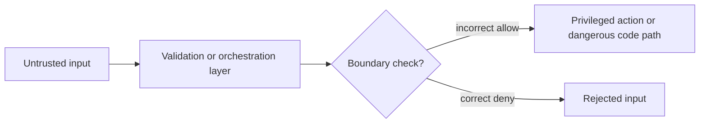

# Threat Brief: CVE-2026-1340

Priority score: 9.23

## 1. Threat Snapshot

- What happened: CVE-2026-1340: A code injection in Ivanti Endpoint Manager Mobile allowing attackers to achieve unauthenticated remote code e
- Why it matters now: Confirmed exploitation increases operational urgency.
- Exact date or date range: 2026-01-30T05:15:53Z to 2026-04-08T06:00:00Z
- One-line confidence statement: High confidence. Confirmed claims come from official source material.


## 2. Evidence

- NVD CVE API 2.0 with URL: https://nvd.nist.gov/vuln/detail/CVE-2026-1340 (2026-01-30T05:15:53Z)
- CISA Known Exploited Vulnerabilities with URL: https://www.cisa.gov/sites/default/files/feeds/known_exploited_vulnerabilities.json (2026-04-08T06:00:00Z) - CVE-2026-1340 catalog entry
- CVE Program record with URL: https://www.cve.org/CVERecord?id=CVE-2026-1340


## 3. Simple Explanation

A code injection in Ivanti Endpoint Manager Mobile allowing attackers to achieve unauthenticated remote code execution. Because there is evidence of exploitation, defenders should treat this as active-response work. Start by checking whether the affected product, parser, or trust boundary exists in your environment. Then confirm patch status, exposed attack surface, and whether compensating controls already block the path.


## 4. Deep Technical Breakdown

- Trust boundary: user-controlled text is mixed into a command, query, template, or execution context.
- Vulnerable component: the tokenizer, interpreter, or templating engine.
- State transition or parser failure: delimiters or execution markers are interpreted as control syntax instead of inert data.
- Why the bug matters: the application hands authority to untrusted input at exactly the point where instructions are parsed.


## 5. Visualization




## 6. Safe Byte-Level Teaching Example

```text
Offset  Size  Field          Example        Meaning
0x00    2     length         0x0010         Declared parser length
0x02    2     flags          0x0001         Validation or mode bits
0x04    N     data           41 41 41 41    Untrusted bytes begin here
```


## 7. Detection and Mitigation

- Detection ideas: prioritize exposed instances and collect signs of exploitation before routine patch rollout.
- Hardening or patching guidance: apply vendor fixes, validate compensating controls, and reduce reachable attack surface.
- Operational triage advice: confirm ownership, patch window, exposure, and customer-facing blast radius before you publish conclusions.


## 8. Unknowns

- Missing evidence: public references may still omit product-specific deployment context.
- Competing explanations: the exact root cause may differ from the inferred category until a vendor advisory or writeup confirms it.
- What to verify next: affected versions, internet exposure, vendor remediation notes, and whether exploitation has been observed in your fleet.
