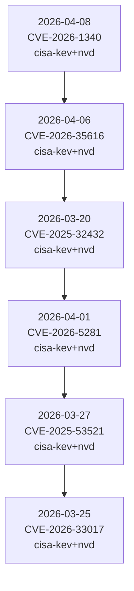

# Latest Cyber Threat Pack

Generated at: 2026-04-09T01:18:21Z

## Prioritized Queue

### 1. Ivanti Endpoint Manager Mobile (EPMM): Ivanti Endpoint Manager Mobile (EPMM) Code Injection Vulnerability
- Canonical ID: `CVE-2026-1340`
- Sources: cisa-kev, nvd
- Latest evidence date: 2026-04-08T06:00:00Z
- Priority score: 14.13
- Exploited in the wild: yes
- CVSS base score: 9.8
- Summary: Ivanti Endpoint Manager Mobile (EPMM) contains a code injection vulnerability that could allow attackers to achieve unauthenticated remote code execution. CISA remediation due date: 2026-04-11. Known ransomware campaign use: Unknown.
- Teaching angle: Show delimiter boundaries and where trusted instructions mix with attacker input.
- Teaching angle: Explain tokenizer or parser context changes step by step.
- Teaching angle: Use benign payload placeholders rather than runnable attack strings.
- Evidence: [CISA Known Exploited Vulnerabilities](https://www.cisa.gov/sites/default/files/feeds/known_exploited_vulnerabilities.json) (2026-04-08T06:00:00Z) - CVE-2026-1340 catalog entry
- Evidence: [NVD CVE API 2.0](https://nvd.nist.gov/vuln/detail/CVE-2026-1340) (2026-01-30T05:15:53Z)

### 2. Fortinet FortiClient EMS: Fortinet FortiClient EMS Improper Access Control Vulnerability
- Canonical ID: `CVE-2026-35616`
- Sources: cisa-kev, nvd
- Latest evidence date: 2026-04-06T06:00:00Z
- Priority score: 11.97
- Exploited in the wild: yes
- CVSS base score: 9.8
- Summary: Fortinet FortiClient EMS contains an improper access control vulnerability that may allow an unauthenticated attacker to execute unauthorized code or commands via crafted requests. CISA remediation due date: 2026-04-09. Known ransomware campaign use: Unknown.
- Teaching angle: Show delimiter boundaries and where trusted instructions mix with attacker input.
- Teaching angle: Explain tokenizer or parser context changes step by step.
- Teaching angle: Use benign payload placeholders rather than runnable attack strings.
- Evidence: [CISA Known Exploited Vulnerabilities](https://www.cisa.gov/sites/default/files/feeds/known_exploited_vulnerabilities.json) (2026-04-06T06:00:00Z) - CVE-2026-35616 catalog entry
- Evidence: [NVD CVE API 2.0](https://nvd.nist.gov/vuln/detail/CVE-2026-35616) (2026-04-04T07:16:39Z)

### 3. Craft CMS Craft CMS: Craft CMS Code Injection Vulnerability
- Canonical ID: `CVE-2025-32432`
- Sources: cisa-kev, nvd
- Latest evidence date: 2026-03-20T06:00:00Z
- Priority score: 11.5
- Exploited in the wild: yes
- CVSS base score: 10.0
- Summary: Craft is a flexible, user-friendly CMS for creating custom digital experiences on the web and beyond. Starting from version 3.0.0-RC1 to before 3.9.15, 4.0.0-RC1 to before 4.14.15, and 5.0.0-RC1 to before 5.6.17, Craft is vulnerable to remote code execution. This is a high-impact, low-complexity attack vector. This issue has been patched in versions 3.9.15, 4.14.15, and 5.6.17, and is an additional fix for CVE-2023-41892.
- Teaching angle: Show delimiter boundaries and where trusted instructions mix with attacker input.
- Teaching angle: Explain tokenizer or parser context changes step by step.
- Teaching angle: Use benign payload placeholders rather than runnable attack strings.
- Evidence: [CISA Known Exploited Vulnerabilities](https://www.cisa.gov/sites/default/files/feeds/known_exploited_vulnerabilities.json) (2026-03-20T06:00:00Z) - CVE-2025-32432 catalog entry
- Evidence: [NVD CVE API 2.0](https://nvd.nist.gov/vuln/detail/CVE-2025-32432) (2025-04-25T21:15:36Z)

### 4. Google Dawn: Google Dawn Use-After-Free Vulnerability
- Canonical ID: `CVE-2026-5281`
- Sources: cisa-kev, nvd
- Latest evidence date: 2026-04-01T11:16:01Z
- Priority score: 11.37
- Exploited in the wild: yes
- CVSS base score: 8.8
- Summary: Google Dawn contains an use-after-free vulnerability that could allow a remote attacker who had compromised the renderer process to execute arbitrary code via a crafted HTML page. This vulnerability could affect multiple Chromium-based products including, but not limited to, Google Chrome, Microsoft Edge, and Opera. CISA remediation due date: 2026-04-15. Known ransomware campaign use: Unknown.
- Teaching angle: Show a tiny memory-layout diagram with length, flags, and attacker-controlled bytes.
- Teaching angle: Explain how bounds checks fail before any shellcode discussion.
- Teaching angle: Use endianness and offset math instead of exploit strings.
- Evidence: [CISA Known Exploited Vulnerabilities](https://www.cisa.gov/sites/default/files/feeds/known_exploited_vulnerabilities.json) (2026-04-01T06:00:00Z) - CVE-2026-5281 catalog entry
- Evidence: [NVD CVE API 2.0](https://nvd.nist.gov/vuln/detail/CVE-2026-5281) (2026-04-01T11:16:01Z)

### 5. F5 BIG-IP: F5 BIG-IP Stack-Based Buffer Overflow Vulnerability
- Canonical ID: `CVE-2025-53521`
- Sources: cisa-kev, nvd
- Latest evidence date: 2026-03-27T06:00:00Z
- Priority score: 11.15
- Exploited in the wild: yes
- CVSS base score: 9.3
- Summary: When a BIG-IP APM access policy is configured on a virtual server, specific malicious traffic can lead to Remote Code Execution (RCE). Note: Software versions which have reached End of Technical Support (EoTS) are not evaluated.
- Teaching angle: Show a tiny memory-layout diagram with length, flags, and attacker-controlled bytes.
- Teaching angle: Explain how bounds checks fail before any shellcode discussion.
- Teaching angle: Use endianness and offset math instead of exploit strings.
- Evidence: [CISA Known Exploited Vulnerabilities](https://www.cisa.gov/sites/default/files/feeds/known_exploited_vulnerabilities.json) (2026-03-27T06:00:00Z) - CVE-2025-53521 catalog entry
- Evidence: [NVD CVE API 2.0](https://nvd.nist.gov/vuln/detail/CVE-2025-53521) (2025-10-15T20:15:48Z)

### 6. Langflow Langflow: Langflow Code Injection Vulnerability
- Canonical ID: `CVE-2026-33017`
- Sources: cisa-kev, nvd
- Latest evidence date: 2026-03-25T06:00:00Z
- Priority score: 11.15
- Exploited in the wild: yes
- CVSS base score: 9.3
- Summary: Langflow is a tool for building and deploying AI-powered agents and workflows. In versions prior to 1.9.0, the POST /api/v1/build_public_tmp/{flow_id}/flow endpoint allows building public flows without requiring authentication. When the optional data parameter is supplied, the endpoint uses attacker-controlled flow data (containing arbitrary Python code in node definitions) instead of the stored flow data from the database. This code is passed to exec() with zero sandboxing, resulting in unauthenticated remote code execution. This is distinct from CVE-2025-3248, which fixed /api/v1/validate/code by adding authentication. The build_public_tmp endpoint is designed to be unauthenticated (for public flows) but incorrectly accepts attacker-supplied flow data containing arbitrary executable code. This issue has been fixed in version 1.9.0.
- Teaching angle: Show delimiter boundaries and where trusted instructions mix with attacker input.
- Teaching angle: Explain tokenizer or parser context changes step by step.
- Teaching angle: Use benign payload placeholders rather than runnable attack strings.
- Evidence: [CISA Known Exploited Vulnerabilities](https://www.cisa.gov/sites/default/files/feeds/known_exploited_vulnerabilities.json) (2026-03-25T06:00:00Z) - CVE-2026-33017 catalog entry
- Evidence: [NVD CVE API 2.0](https://nvd.nist.gov/vuln/detail/CVE-2026-33017) (2026-03-20T11:16:15Z)

### 7. TrueConf Client: TrueConf Client Download of Code Without Integrity Check Vulnerability
- Canonical ID: `CVE-2026-3502`
- Sources: cisa-kev, nvd
- Latest evidence date: 2026-04-02T06:00:00Z
- Priority score: 11.13
- Exploited in the wild: yes
- CVSS base score: 7.8
- Summary: TrueConf Client contains a download of code without integrity check vulnerability. An attacker who is able to influence the update delivery path can substitute a tampered update payload. If the payload is executed or installed by the updater, this may result in arbitrary code execution in the context of the updating process or user. CISA remediation due date: 2026-04-16. Known ransomware campaign use: Unknown.
- Teaching angle: Map the trust chain from maintainer to build system to runtime.
- Teaching angle: Show where signatures, manifests, or lockfiles are supposed to be enforced.
- Teaching angle: Use a package metadata sketch instead of malicious package contents.
- Evidence: [CISA Known Exploited Vulnerabilities](https://www.cisa.gov/sites/default/files/feeds/known_exploited_vulnerabilities.json) (2026-04-02T06:00:00Z) - CVE-2026-3502 catalog entry
- Evidence: [NVD CVE API 2.0](https://nvd.nist.gov/vuln/detail/CVE-2026-3502) (2026-03-31T01:16:27Z)

### 8. Laravel Livewire: Laravel Livewire Code Injection Vulnerability
- Canonical ID: `CVE-2025-54068`
- Sources: cisa-kev, nvd
- Latest evidence date: 2026-03-20T06:00:00Z
- Priority score: 11.1
- Exploited in the wild: yes
- CVSS base score: 9.2
- Summary: Livewire is a full-stack framework for Laravel. In Livewire v3 up to and including v3.6.3, a vulnerability allows unauthenticated attackers to achieve remote command execution in specific scenarios. The issue stems from how certain component property updates are hydrated. This vulnerability is unique to Livewire v3 and does not affect prior major versions. Exploitation requires a component to be mounted and configured in a particular way, but does not require authentication or user interaction. This issue has been patched in Livewire v3.6.4. All users are strongly encouraged to upgrade to this version or later as soon as possible. No known workarounds are available.
- Teaching angle: Show delimiter boundaries and where trusted instructions mix with attacker input.
- Teaching angle: Explain tokenizer or parser context changes step by step.
- Teaching angle: Use benign payload placeholders rather than runnable attack strings.
- Evidence: [CISA Known Exploited Vulnerabilities](https://www.cisa.gov/sites/default/files/feeds/known_exploited_vulnerabilities.json) (2026-03-20T06:00:00Z) - CVE-2025-54068 catalog entry
- Evidence: [NVD CVE API 2.0](https://nvd.nist.gov/vuln/detail/CVE-2025-54068) (2025-07-18T01:15:25Z)

### 9. Aquasecurity Trivy: Aquasecurity Trivy Embedded Malicious Code Vulnerability
- Canonical ID: `CVE-2026-33634`
- Sources: cisa-kev, nvd
- Latest evidence date: 2026-03-26T06:00:00Z
- Priority score: 9.7
- Exploited in the wild: yes
- CVSS base score: 9.4
- Summary: Trivy is a security scanner. On March 19, 2026, a threat actor used compromised credentials to publish a malicious Trivy v0.69.4 release, force-push 76 of 77 version tags in `aquasecurity/trivy-action` to credential-stealing malware, and replace all 7 tags in `aquasecurity/setup-trivy` with malicious commits. This incident is a continuation of the supply chain attack that began in late February 2026. Following the initial disclosure on March 1, credential rotation was performed but was not atomic (not all credentials were revoked simultaneously). The attacker could have use a valid token to exfiltrate newly rotated secrets during the rotation window (which lasted a few days). This could have allowed the attacker to retain access and execute the March 19 attack. Affected components include the `aquasecurity/trivy` Go / Container image version 0.69.4, the `aquasecurity/trivy-action` GitHub Action versions 0.0.1 – 0.34.2 (76/77), and the`aquasecurity/setup-trivy` GitHub Action versions 0.2.0 – 0.2.6, prior to the recreation of 0.2.6 with a safe commit. Known safe versions include versions 0.69.2 and 0.69.3 of the Trivy binary, version 0.35.0 of trivy-action, and version 0.2.6 of setup-trivy. Additionally, take other mitigations to ensure the safety of secrets. If there is any possibility that a compromised version ran in one's environment, all secrets accessible to affected pipelines must be treated as exposed and rotated immediately. Check whether one's organization pulled or executed Trivy v0.69.4 from any source. Remove any affected artifacts immediately. Review all workflows using `aquasecurity/trivy-action` or `aquasecurity/setup-trivy`. Those who referenced a version tag rather than a full commit SHA should check workflow run logs from March 19–20, 2026 for signs of compromise. Look for repositories named `tpcp-docs` in one's GitHub organization. The presence of such a repository may indicate that the fallback exfiltration mechanism was triggered and secrets were successfully stolen. Pin GitHub Actions to full, immutable commit SHA hashes, don't use mutable version tags.
- Teaching angle: Draw the request-to-session validation path and the missing check.
- Teaching angle: Show the token fields or state transitions that matter.
- Teaching angle: Contrast accepted vs rejected validation flow.
- Evidence: [CISA Known Exploited Vulnerabilities](https://www.cisa.gov/sites/default/files/feeds/known_exploited_vulnerabilities.json) (2026-03-26T06:00:00Z) - CVE-2026-33634 catalog entry
- Evidence: [NVD CVE API 2.0](https://nvd.nist.gov/vuln/detail/CVE-2026-33634) (2026-03-24T04:16:31Z)

### 10. Citrix NetScaler: Citrix NetScaler Out-of-Bounds Read Vulnerability
- Canonical ID: `CVE-2026-3055`
- Sources: cisa-kev, nvd
- Latest evidence date: 2026-03-30T06:00:00Z
- Priority score: 9.65
- Exploited in the wild: yes
- CVSS base score: 9.3
- Summary: Citrix NetScaler ADC (formerly Citrix ADC), NetScaler Gateway (formerly Citrix Gateway) and NetScaler ADC FIPS and NDcPP contain an out-of-bounds reads vulnerability when configured as a SAML IDP leading to memory overread. CISA remediation due date: 2026-04-02. Known ransomware campaign use: Unknown.
- Teaching angle: Show a tiny memory-layout diagram with length, flags, and attacker-controlled bytes.
- Teaching angle: Explain how bounds checks fail before any shellcode discussion.
- Teaching angle: Use endianness and offset math instead of exploit strings.
- Evidence: [CISA Known Exploited Vulnerabilities](https://www.cisa.gov/sites/default/files/feeds/known_exploited_vulnerabilities.json) (2026-03-30T06:00:00Z) - CVE-2026-3055 catalog entry
- Evidence: [NVD CVE API 2.0](https://nvd.nist.gov/vuln/detail/CVE-2026-3055) (2026-03-24T03:17:17Z)

### 11. CVE-2026-5628: A security vulnerability has been detected in Belkin F9K1015 1.00.10. Impacted is the function formSetSystemSe
- Canonical ID: `CVE-2026-5628`
- Sources: nvd
- Latest evidence date: 2026-04-06T12:16:22Z
- Priority score: 5.85
- Exploited in the wild: not confirmed
- CVSS base score: 7.4
- Summary: A security vulnerability has been detected in Belkin F9K1015 1.00.10. Impacted is the function formSetSystemSettings of the file /goform/formSetSystemSettings of the component Setting Handler. The manipulation of the argument webpage leads to stack-based buffer overflow. Remote exploitation of the attack is possible. The exploit has been disclosed publicly and may be used. The vendor was contacted early about this disclosure but did not respond in any way.
- Teaching angle: Show a tiny memory-layout diagram with length, flags, and attacker-controlled bytes.
- Teaching angle: Explain how bounds checks fail before any shellcode discussion.
- Teaching angle: Use endianness and offset math instead of exploit strings.
- Evidence: [NVD CVE API 2.0](https://nvd.nist.gov/vuln/detail/CVE-2026-5628) (2026-04-06T12:16:22Z)

### 12. CVE-2026-5629: A vulnerability was detected in Belkin F9K1015 1.00.10. The affected element is the function formSetFirewall o
- Canonical ID: `CVE-2026-5629`
- Sources: nvd
- Latest evidence date: 2026-04-06T12:16:22Z
- Priority score: 5.85
- Exploited in the wild: not confirmed
- CVSS base score: 7.4
- Summary: A vulnerability was detected in Belkin F9K1015 1.00.10. The affected element is the function formSetFirewall of the file /goform/formSetFirewall. The manipulation of the argument webpage results in stack-based buffer overflow. The attack can be executed remotely. The exploit is now public and may be used. The vendor was contacted early about this disclosure but did not respond in any way.
- Teaching angle: Show a tiny memory-layout diagram with length, flags, and attacker-controlled bytes.
- Teaching angle: Explain how bounds checks fail before any shellcode discussion.
- Teaching angle: Use endianness and offset math instead of exploit strings.
- Evidence: [NVD CVE API 2.0](https://nvd.nist.gov/vuln/detail/CVE-2026-5629) (2026-04-06T12:16:22Z)

### 13. CVE-2026-5614: A security flaw has been discovered in Belkin F9K1015 1.00.10. Impacted is the function formSetPassword of the
- Canonical ID: `CVE-2026-5614`
- Sources: nvd
- Latest evidence date: 2026-04-06T10:16:09Z
- Priority score: 5.82
- Exploited in the wild: not confirmed
- CVSS base score: 7.4
- Summary: A security flaw has been discovered in Belkin F9K1015 1.00.10. Impacted is the function formSetPassword of the file /goform/formSetPassword. The manipulation of the argument webpage results in stack-based buffer overflow. The attack may be launched remotely. The exploit has been released to the public and may be used for attacks. The vendor was contacted early about this disclosure but did not respond in any way.
- Teaching angle: Show a tiny memory-layout diagram with length, flags, and attacker-controlled bytes.
- Teaching angle: Explain how bounds checks fail before any shellcode discussion.
- Teaching angle: Use endianness and offset math instead of exploit strings.
- Evidence: [NVD CVE API 2.0](https://nvd.nist.gov/vuln/detail/CVE-2026-5614) (2026-04-06T10:16:09Z)

### 14. CVE-2026-5611: A vulnerability was found in Belkin F9K1015 1.00.10. This affects the function formCrossBandSwitch of the file
- Canonical ID: `CVE-2026-5611`
- Sources: nvd
- Latest evidence date: 2026-04-06T09:16:07Z
- Priority score: 5.81
- Exploited in the wild: not confirmed
- CVSS base score: 7.4
- Summary: A vulnerability was found in Belkin F9K1015 1.00.10. This affects the function formCrossBandSwitch of the file /goform/formCrossBandSwitch. Performing a manipulation of the argument webpage results in stack-based buffer overflow. The attack can be initiated remotely. The exploit has been made public and could be used. The vendor was contacted early about this disclosure but did not respond in any way.
- Teaching angle: Show a tiny memory-layout diagram with length, flags, and attacker-controlled bytes.
- Teaching angle: Explain how bounds checks fail before any shellcode discussion.
- Teaching angle: Use endianness and offset math instead of exploit strings.
- Evidence: [NVD CVE API 2.0](https://nvd.nist.gov/vuln/detail/CVE-2026-5611) (2026-04-06T09:16:07Z)

### 15. CVE-2026-5612: A vulnerability was determined in Belkin F9K1015 1.00.10. This vulnerability affects the function formWlEncryp
- Canonical ID: `CVE-2026-5612`
- Sources: nvd
- Latest evidence date: 2026-04-06T09:16:07Z
- Priority score: 5.81
- Exploited in the wild: not confirmed
- CVSS base score: 7.4
- Summary: A vulnerability was determined in Belkin F9K1015 1.00.10. This vulnerability affects the function formWlEncrypt of the file /goform/formWlEncrypt. Executing a manipulation of the argument webpage can lead to stack-based buffer overflow. The attack can be launched remotely. The exploit has been publicly disclosed and may be utilized. The vendor was contacted early about this disclosure but did not respond in any way.
- Teaching angle: Show a tiny memory-layout diagram with length, flags, and attacker-controlled bytes.
- Teaching angle: Explain how bounds checks fail before any shellcode discussion.
- Teaching angle: Use endianness and offset math instead of exploit strings.
- Evidence: [NVD CVE API 2.0](https://nvd.nist.gov/vuln/detail/CVE-2026-5612) (2026-04-06T09:16:07Z)

### 16. CVE-2026-5613: A vulnerability was identified in Belkin F9K1015 1.00.10. This issue affects the function formReboot of the fi
- Canonical ID: `CVE-2026-5613`
- Sources: nvd
- Latest evidence date: 2026-04-06T09:16:07Z
- Priority score: 5.81
- Exploited in the wild: not confirmed
- CVSS base score: 7.4
- Summary: A vulnerability was identified in Belkin F9K1015 1.00.10. This issue affects the function formReboot of the file /goform/formReboot. The manipulation of the argument webpage leads to stack-based buffer overflow. The attack may be initiated remotely. The exploit is publicly available and might be used. The vendor was contacted early about this disclosure but did not respond in any way.
- Teaching angle: Show a tiny memory-layout diagram with length, flags, and attacker-controlled bytes.
- Teaching angle: Explain how bounds checks fail before any shellcode discussion.
- Teaching angle: Use endianness and offset math instead of exploit strings.
- Evidence: [NVD CVE API 2.0](https://nvd.nist.gov/vuln/detail/CVE-2026-5613) (2026-04-06T09:16:07Z)

### 17. CVE-2026-5609: A flaw has been found in Tenda i12 1.0.0.11(3862). Affected by this vulnerability is the function formwrlSSIDs
- Canonical ID: `CVE-2026-5609`
- Sources: nvd
- Latest evidence date: 2026-04-06T08:16:00Z
- Priority score: 5.8
- Exploited in the wild: not confirmed
- CVSS base score: 7.4
- Summary: A flaw has been found in Tenda i12 1.0.0.11(3862). Affected by this vulnerability is the function formwrlSSIDset of the file /goform/wifiSSIDset of the component Parameter Handler. This manipulation of the argument index/wl_radio causes stack-based buffer overflow. It is possible to initiate the attack remotely. The exploit has been published and may be used.
- Teaching angle: Show a tiny memory-layout diagram with length, flags, and attacker-controlled bytes.
- Teaching angle: Explain how bounds checks fail before any shellcode discussion.
- Teaching angle: Use endianness and offset math instead of exploit strings.
- Evidence: [NVD CVE API 2.0](https://nvd.nist.gov/vuln/detail/CVE-2026-5609) (2026-04-06T08:16:00Z)

### 18. CVE-2026-5610: A vulnerability has been found in Belkin F9K1015 1.00.10. Affected by this issue is the function formWISP5G of
- Canonical ID: `CVE-2026-5610`
- Sources: nvd
- Latest evidence date: 2026-04-06T08:16:00Z
- Priority score: 5.8
- Exploited in the wild: not confirmed
- CVSS base score: 7.4
- Summary: A vulnerability has been found in Belkin F9K1015 1.00.10. Affected by this issue is the function formWISP5G of the file /goform/formWISP5G. Such manipulation of the argument webpage leads to stack-based buffer overflow. It is possible to launch the attack remotely. The exploit has been disclosed to the public and may be used. The vendor was contacted early about this disclosure but did not respond in any way.
- Teaching angle: Show a tiny memory-layout diagram with length, flags, and attacker-controlled bytes.
- Teaching angle: Explain how bounds checks fail before any shellcode discussion.
- Teaching angle: Use endianness and offset math instead of exploit strings.
- Evidence: [NVD CVE API 2.0](https://nvd.nist.gov/vuln/detail/CVE-2026-5610) (2026-04-06T08:16:00Z)

### 19. CVE-2026-5642: A vulnerability was determined in Cyber-III Student-Management-System up to 1a938fa61e9f735078e9b291d2e6215b49
- Canonical ID: `CVE-2026-5642`
- Sources: nvd
- Latest evidence date: 2026-04-06T16:16:02Z
- Priority score: 5.66
- Exploited in the wild: not confirmed
- CVSS base score: 6.9
- Summary: A vulnerability was determined in Cyber-III Student-Management-System up to 1a938fa61e9f735078e9b291d2e6215b4942af3f. This affects an unknown function of the file /viva/update.php of the component HTTP POST Request Handler. This manipulation of the argument Name causes improper authorization. It is possible to initiate the attack remotely. The exploit has been publicly disclosed and may be utilized. This product is using a rolling release to provide continious delivery. Therefore, no version details for affected nor updated releases are available. The project was informed of the problem early through an issue report but has not responded yet.
- Teaching angle: Draw the request-to-session validation path and the missing check.
- Teaching angle: Show the token fields or state transitions that matter.
- Teaching angle: Contrast accepted vs rejected validation flow.
- Evidence: [NVD CVE API 2.0](https://nvd.nist.gov/vuln/detail/CVE-2026-5642) (2026-04-06T16:16:02Z)

### 20. CVE-2026-5637: A security vulnerability has been detected in projectworlds Car Rental System 1.0. This vulnerability affects
- Canonical ID: `CVE-2026-5637`
- Sources: nvd
- Latest evidence date: 2026-04-06T15:16:18Z
- Priority score: 5.64
- Exploited in the wild: not confirmed
- CVSS base score: 6.9
- Summary: A security vulnerability has been detected in projectworlds Car Rental System 1.0. This vulnerability affects unknown code of the file /message_admin.php of the component Parameter Handler. Such manipulation of the argument Message leads to sql injection. The attack may be launched remotely. The exploit has been disclosed publicly and may be used.
- Teaching angle: Show delimiter boundaries and where trusted instructions mix with attacker input.
- Teaching angle: Explain tokenizer or parser context changes step by step.
- Teaching angle: Use benign payload placeholders rather than runnable attack strings.
- Evidence: [NVD CVE API 2.0](https://nvd.nist.gov/vuln/detail/CVE-2026-5637) (2026-04-06T15:16:18Z)

### 21. Russia's Forest Blizzard Nabs Rafts of Logins Via SOHO Routers
- Canonical ID: `darkreading:russia-forest-blizzard-logins-soho-routers`
- Sources: darkreading
- Latest evidence date: 2026-04-09T01:00:00Z
- Priority score: 3.0
- Exploited in the wild: not confirmed
- Summary: Heard of fileless malware? How about malwareless cyber espionage? Russia's APT28 is spying on global organizations by modifying just one DNS setting in vulnerable routers.
- Teaching angle: Explain the vulnerable parser or state machine in three steps.
- Teaching angle: Use a small mermaid diagram for data flow from input to sink.
- Teaching angle: If bytes matter, show a synthetic structure layout rather than a weaponized payload.
- Evidence: [Dark Reading RSS](https://www.darkreading.com/threat-intelligence/russia-forest-blizzard-logins-soho-routers) (2026-04-09T01:00:00Z)

### 22. Threat Actors Get Crafty With Emojis to Escape Detection
- Canonical ID: `darkreading:emojis-power-covert-threat-actor-communications`
- Sources: darkreading
- Latest evidence date: 2026-04-08T20:21:32Z
- Priority score: 2.93
- Exploited in the wild: not confirmed
- Summary: When 🤖 means "bot available," 🧰 signifies "toolkit," or 💰💰💰 translates to "big ransom," bad actors can evade filters and keep it all on the down-low.
- Teaching angle: Explain the vulnerable parser or state machine in three steps.
- Teaching angle: Use a small mermaid diagram for data flow from input to sink.
- Teaching angle: If bytes matter, show a synthetic structure layout rather than a weaponized payload.
- Evidence: [Dark Reading RSS](https://www.darkreading.com/cyber-risk/emojis-power-covert-threat-actor-communications) (2026-04-08T20:21:32Z)

### 23. AI-Led Remediation Crisis Prompts HackerOne to Pause Bug Bounties
- Canonical ID: `darkreading:ai-led-remediation-crisis-prompts-hackerone-pause-bug-bounties`
- Sources: darkreading
- Latest evidence date: 2026-04-08T19:47:32Z
- Priority score: 2.92
- Exploited in the wild: not confirmed
- Summary: Discovery used to be the bottleneck for open source bugs, but with automated discovery, remediation's the bottleneck, which bounties don't fund.
- Teaching angle: Show delimiter boundaries and where trusted instructions mix with attacker input.
- Teaching angle: Explain tokenizer or parser context changes step by step.
- Teaching angle: Use benign payload placeholders rather than runnable attack strings.
- Evidence: [Dark Reading RSS](https://www.darkreading.com/application-security/ai-led-remediation-crisis-prompts-hackerone-pause-bug-bounties) (2026-04-08T19:47:32Z)

### 24. Fraud Rockets Higher in Mobile-First Latin America
- Canonical ID: `darkreading:fraud-mobile-first-latin-america`
- Sources: darkreading
- Latest evidence date: 2026-04-08T15:45:11Z
- Priority score: 2.87
- Exploited in the wild: not confirmed
- Summary: Cyber-fraudsters move quickly from compromised devices to account takeover to funds transfer, shifting money before many financial institutions can react.
- Teaching angle: Explain the vulnerable parser or state machine in three steps.
- Teaching angle: Use a small mermaid diagram for data flow from input to sink.
- Teaching angle: If bytes matter, show a synthetic structure layout rather than a weaponized payload.
- Evidence: [Dark Reading RSS](https://www.darkreading.com/cyberattacks-data-breaches/fraud-mobile-first-latin-america) (2026-04-08T15:45:11Z)

### 25. Full Sail University to Open IBM Cyber Defense Range Powered by AWS and Cloud Range on Campus
- Canonical ID: `darkreading:full-sail-university-ibm-cyber-defense-range-aws-cloud-range`
- Sources: darkreading
- Latest evidence date: 2026-04-08T14:43:49Z
- Priority score: 2.85
- Exploited in the wild: not confirmed
- Summary: 
- Teaching angle: Explain the vulnerable parser or state machine in three steps.
- Teaching angle: Use a small mermaid diagram for data flow from input to sink.
- Teaching angle: If bytes matter, show a synthetic structure layout rather than a weaponized payload.
- Evidence: [Dark Reading RSS](https://www.darkreading.com/cybersecurity-operations/full-sail-university-ibm-cyber-defense-range-aws-cloud-range) (2026-04-08T14:43:49Z)

### 26. Niobium Introduces The Fog
- Canonical ID: `darkreading:niobium-introduces-the-fog`
- Sources: darkreading
- Latest evidence date: 2026-04-08T14:22:33Z
- Priority score: 2.85
- Exploited in the wild: not confirmed
- Summary: 
- Teaching angle: Explain the vulnerable parser or state machine in three steps.
- Teaching angle: Use a small mermaid diagram for data flow from input to sink.
- Teaching angle: If bytes matter, show a synthetic structure layout rather than a weaponized payload.
- Evidence: [Dark Reading RSS](https://www.darkreading.com/endpoint-security/niobium-introduces-the-fog) (2026-04-08T14:22:33Z)

### 27. Pluralsight Launches SecureReady to Help Organizations Build Job-Ready Cybersecurity Teams
- Canonical ID: `darkreading:pluralsight-launches-secureready-cybersecurity-teams`
- Sources: darkreading
- Latest evidence date: 2026-04-08T14:08:22Z
- Priority score: 2.84
- Exploited in the wild: not confirmed
- Summary: 
- Teaching angle: Explain the vulnerable parser or state machine in three steps.
- Teaching angle: Use a small mermaid diagram for data flow from input to sink.
- Teaching angle: If bytes matter, show a synthetic structure layout rather than a weaponized payload.
- Evidence: [Dark Reading RSS](https://www.darkreading.com/remote-workforce/pluralsight-launches-secureready-cybersecurity-teams) (2026-04-08T14:08:22Z)

### 28. Iranian Threat Actors Disrupt US Critical Infrastructure Via Exposed PLCs
- Canonical ID: `darkreading:iranian-threat-actors-us-critical-infrastructure-exposed-plcs`
- Sources: darkreading
- Latest evidence date: 2026-04-08T13:46:29Z
- Priority score: 2.84
- Exploited in the wild: not confirmed
- Summary: Attackers compromised Internet-facing OT devices and caused file and display manipulation, operational disruption, and financial losses across sectors.
- Teaching angle: Explain the vulnerable parser or state machine in three steps.
- Teaching angle: Use a small mermaid diagram for data flow from input to sink.
- Teaching angle: If bytes matter, show a synthetic structure layout rather than a weaponized payload.
- Evidence: [Dark Reading RSS](https://www.darkreading.com/ics-ot-security/iranian-threat-actors-us-critical-infrastructure-exposed-plcs) (2026-04-08T13:46:29Z)

### 29. Storm-1175 Deploys Medusa Ransomware at 'High Velocity'
- Canonical ID: `darkreading:storm-1175-medusa-ransomware-high-velocity`
- Sources: darkreading
- Latest evidence date: 2026-04-07T20:15:07Z
- Priority score: 2.6
- Exploited in the wild: not confirmed
- Summary: Microsoft says the financially motivated cybercrime group has exploited N-day and zero-day vulnerabilities in campaigns predicated on speed.
- Teaching angle: Explain the vulnerable parser or state machine in three steps.
- Teaching angle: Use a small mermaid diagram for data flow from input to sink.
- Teaching angle: If bytes matter, show a synthetic structure layout rather than a weaponized payload.
- Evidence: [Dark Reading RSS](https://www.darkreading.com/threat-intelligence/storm-1175-medusa-ransomware-high-velocity) (2026-04-07T20:15:07Z)

### 30. Grafana Patches AI Bug That Could Have Leaked User Data
- Canonical ID: `darkreading:grafana-patches-ai-bug-leaked-user-data`
- Sources: darkreading
- Latest evidence date: 2026-04-07T19:52:26Z
- Priority score: 2.59
- Exploited in the wild: not confirmed
- Summary: By hiding malicious instructions on an attacker-controlled Web page, AI could ingest orders that appear benign but return sensitive data to the attacker's server.
- Teaching angle: Explain the vulnerable parser or state machine in three steps.
- Teaching angle: Use a small mermaid diagram for data flow from input to sink.
- Teaching angle: If bytes matter, show a synthetic structure layout rather than a weaponized payload.
- Evidence: [Dark Reading RSS](https://www.darkreading.com/application-security/grafana-patches-ai-bug-leaked-user-data) (2026-04-07T19:52:26Z)

## Signal Timeline

## Suggested Next Steps

1. Pick the top one to three items and verify them against primary sources and any vendor advisory.
2. Turn each item into a four-layer explainer: plain English, component internals, low-level structure, and defender takeaways.
3. Label every claim as Confirmed, Inferred, or Unknown before publishing a final brief.
