# 💎 Aster & The Swarm: Strategic Architecture

This document outlines the strategic architecture for the **Aster Trading System** and its autonomous agent swarm.

## 1. The Core Intelligence: Aster 🧠
**Aster** (`TradingService.py`) is the central brain of the operation. It does not just "pass messages"; it performs the heavy cognitive lifting:
*   **Market Regime Detection**: Analyzes cross-chain data to determine if we are in "Bull", "Bear", or "Crab" mode.
*   **Signal Generation**: Runs the "Symmetric Mean Reversion" logic to identify high-probability entries.
*   **Orchestration**: Commands the Swarm based on its high-level view of the battlefield.

---

## 2. Connectivity Architecture 🔌 (Network Optimized)

We maintain distinct connection types optimized for the specific nature of each protocol to ensure **flawless data flow**.

| Protocol | Chain | Type | Connection Method | Optimization |
| :--- | :--- | :--- | :--- | :--- |
| **Symphony** | **Monad** | **REST API** | `https://api.symphony.io` | **Agentic Fund Interface**: Persistent HTTP/2 sessions (Keep-Alive) for low latency management. |
| **Drift** | **Solana** | **RPC + REST** | `Helius RPC` + `Drift SDK` | **Hybrid**: RPC for low-latency account state/signing, CoinGecko fallback for resilient price feeds. |
| **Jupiter** | **Solana** | **Ultra API** | `https://api.jup.ag/ultra/v1` | **Smart Routing**: Offloads route computation to Jupiter's "Ultra" engine (GPU-accelerated pathfinding). |

---

## 2. Communication Flow 🔄

Data flows in a unidirectional loop with feedback, utilizing efficient `asyncio` concurrency (Single-Threaded Event Loop optimized for Cloud Run).

```mermaid
graph TD
    A[Market Data Aggregator] -->|Prices/Vol/Regime| B(Aster: Central Brain)
    B -->|Broadcast State| C{Swarm Consensus}

    subgraph "Aster's Swarm"
        C -->|Execute Signal| D[Drift Sniper 🌊]
        C -->|Allocate Capital| E[Monad Vanguard 🎵]
        C -->|Sweep Profit| F[Jupiter Treasurer 🪐]
    end

    D -->|Perp Trade| G[Drift Protocol]
    E -->|Swap/Stake| H[Symphony Network]
    F -->|Spot Swap| I[Jupiter Exchange]

    G -->|Fill| J[Aster Logger]
    H -->|Fill| J
    I -->|Fill| J

    J -->|Feedback| A
```

---

## 3. Swarm Strategies 🧠

We divide the AI behavior into three distinct "Personas" or Sub-Swarms.

### A. The "Sniper" 🌊 (Drift Agent)
*   **Objective**: High-frequency alpha capture on Perpetual Futures.
*   **Strategy**: **Symmetric Mean Reversion**.
    *   *Entry*: Bollinger Band deviation + RSI Confluence.
    *   *Exit*: Mean (SMA) reversion.
    *   *Timeframe*: 1m - 5m (Tactical).
*   **Risk Profile**: Aggressive but tight stops.
*   **Execution**: Direct RPC signing.

### B. The "Vanguard" 🎵 (Symphony / Monad Agent)
*   **Objective**: **Early Ecosystem Capture** & Maximum Exposure.
*   **Context**: Monad is a **High-Frequency Trading (HFT) EVM** chain. Speed and throughput are its moats. We position for high-velocity asset rotation.
*   **Strategy**: **Ecosystem Vanguard**.
    *   *Logic*: Actively solicits and rotates into high-velocity Monad-native assets.
    *   *Allocation (Dynamic)*:
        *   **Native Core (MON)**: 40% (Gas/Staking).
        *   **Ecosystem Plays (Alphas)**: 40% (**$EMO**, **$MONCOCK**). *User Favorites.*
        *   **Stable Reserve**: 20% (Dry Powder for HFT arbitrage opportunities).
    *   *Behavior*: Aggressive rotation during "Launch Season" (Bull).
*   **Execution**: Symphony Agentic Tools (`create_agentic_fund`, `swap`).

### C. The "Treasurer" 🪐 (Jupiter Agent)
*   **Objective**: Liquidity management and Profit Taking.
*   **Strategy**: **Smart Treasury**.
    *   *Logic*: Periodically sweeps profits from Drift (USDC) and converts them to hard assets (SOL).
    *   *Optimization*: Uses Jupiter Ultra to minimize slippage on large sweeps.
*   **Risk Profile**: Conservative.
*   **Execution**: Ultra API Swaps.

---

## 4. Hardware & Resource Utilization ⚙️

*   **Compute**: Fully asynchronous loop (`asyncio`) allows thousands of concurrent operations on a single vCPU (Cloud Run Standard).
*   **Memory**: DataFrames are pruned (maxlen=200) to keep RAM footprint <512MB.
*   **Network**: HTTP Clients (`httpx.AsyncClient`) use persistent connections to minimize SSL handshake overhead.
