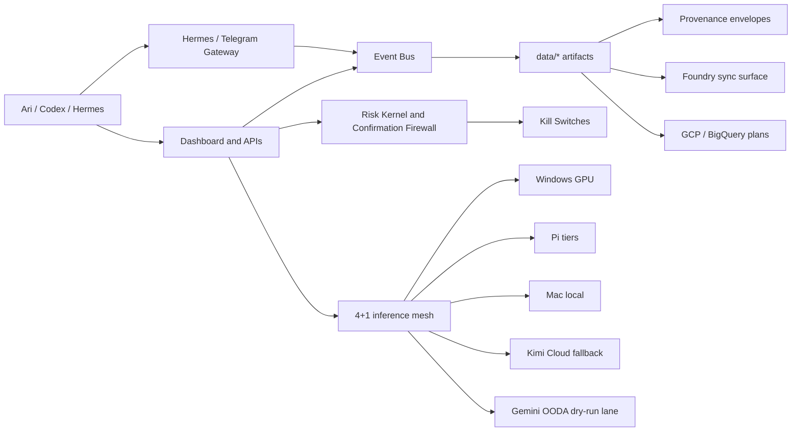

# 01 - Architecture

Sapphire is organized as a control tower around five planes: operator surfaces, local runtimes, safety controls, artifact storage, and external complement lanes. The canonical system map starts in `/Users/aribs/Code/Sapphire/README.md`, while the route-level implementation sits in `/Users/aribs/Code/Sapphire/services/dashboard/app.py` and the operational checks are centralized in `/Users/aribs/Code/Sapphire/scripts/ops/production_readiness_sweep.py`.

The event bus in `/Users/aribs/Code/Sapphire/lib/core/event_bus.py` is the central contract. It publishes typed events such as `signal.generated`, `prediction.generated`, `service.health`, `threat.detected`, and `correlation.broken`. Redis Streams are the preferred backend, with JSONL fallback at `data/events/bus.jsonl` so local development and tests retain replayability. That design matters for diligence because the system is not only doing work; it is emitting an auditable operational timeline.

Storage is tiered instead of casually dumped into the repo. `/Users/aribs/Code/Sapphire/STRUCTURE.md` records the repo layout, while `/Users/aribs/Code/Sapphire/docs/ops/storage-tier-architecture.md` and `/Users/aribs/Code/Sapphire/scripts/ops/storage_tier_sync.py` distinguish hot local runtime state, warm ignored artifacts, cold Proton Drive archives, and source-controlled docs/code. The legacy-code archival evidence is in `/Users/aribs/Code/Sapphire/docs/ops/legacy-code-cold-tier-2026-04-28.md`. The practical result is that buyer-visible source remains readable while runtime evidence is still preserved, hashed, and recoverable.

The inference mesh is implemented in `/Users/aribs/Code/Sapphire/services/inference-proxy/app.py`. The proxy exposes OpenAI-compatible endpoints, routes across GPU, Pi, Mac, and Kimi tiers, enforces per-tenant quotas, and exposes `/v1/quota` plus `/v1/cache-stats`. The bounded Gemini lane is deliberately outside the default mesh path. Its live mode is gated by `SAPPHIRE_GEMINI_LIVE=1`, sensitivity classification, per-hour calls, and monthly token limits in `/Users/aribs/Code/Sapphire/plugins/claw-sapphire/tools/internal/gemini_ooda.py`; its daily dry-run cadence is described in `/Users/aribs/Code/Sapphire/docs/ops/gemini-ooda-daily-runbook.md`.

The security platform is split into prevention, confirmation, and shutdown. Prevention includes static hooks and readiness checks: `.gitleaks.toml`, `.gitleaks-docs.toml`, `/Users/aribs/Code/Sapphire/scripts/ops/local_ci_verify.py`, and `/Users/aribs/Code/Sapphire/scripts/ops/production_readiness_sweep.py`. Confirmation is in `/Users/aribs/Code/Sapphire/lib/core/confirmation_firewall.py`, which classifies read-only, system-modifying, external-send, financial, and destructive actions. Shutdown is in `/Users/aribs/Code/Sapphire/lib/core/security_kill_switch.py`, `/Users/aribs/Code/Sapphire/lib/core/kill_switch.py`, and the public risk surface at `/Users/aribs/Code/Sapphire/lib/core/risk_kernel/`.

The architecture is intentionally modular enough to sell in pieces. Foundry sync is in `/Users/aribs/Code/Sapphire/lib/foundry/sync.py` and `/Users/aribs/Code/Sapphire/docs/foundry-sdk-0.1.0.md`. Provenance is in `/Users/aribs/Code/Sapphire/lib/core/provenance.py`. Risk is in `/Users/aribs/Code/Sapphire/lib/core/risk_kernel/`. The dashboard is in `/Users/aribs/Code/Sapphire/services/dashboard/`. Each component is independently testable, but the production-readiness sweep proves the combined system still holds together.

## Diligence Readout

The most important architectural diligence question is whether Sapphire is a coherent system or a pile of scripts. The repo answers that in three ways. First, the event bus gives the system a shared vocabulary and persistence layer. Second, the dashboard and readiness sweep give the operator a single inspection plane. Third, the new product surfaces expose safety and provenance as packages instead of burying them in the trading path. That combination is rare in one-operator autonomy projects, where code often accretes around individual demos and never becomes inspectable.

The second question is where authority lives. Sapphire's answer is "local control tower first." The Mac commander, LaunchAgents, dashboard, event bus, and local CI remain the authority for routine operation. External services are support planes. Kimi is a fallback, not a command source. Gemini is a dry-run OODA complement unless a manual live gate is set. GCP and Vertex are planned for batch/eval/retrieval support, not for taking over mutation. Foundry sync is a product and data plane, not an unsupervised write path.

The third question is whether it can be carved up. A Palantir-style buyer could care about Foundry sync, provenance, event contracts, and readiness sweeps. A Robinhood-style buyer could care about the risk kernel, confirmation firewall, inference governance, and paper/order-draft discipline. A security buyer could care about incident-to-control conversion, secret scanning, Hermes guardrails, and threat-intel routines. The repo's current organization makes those carve-outs plausible because each claim is anchored in files rather than an operator story.

The main architectural risk is still concentration. The system is broad and much of its operational knowledge is encoded in Ari's routines. The mitigation is exactly this packet plus the existing runbooks: make the operating model file-addressable. The next buyer-side improvement would be an architecture test that asserts the Mermaid map against discovered routes, LaunchAgents, event types, and product docs. That would convert this narrative architecture into a continuously verified one.

The immediate technical diligence exercise should be a guided trace: start at a dashboard page, follow the API route, follow the library call, inspect the artifact path, verify the provenance sidecar, and confirm the event or readiness check that reports it. Sapphire is strong when that trace is short. Any long or undocumented trace becomes a post-close hardening task.

## Evidence

- `/Users/aribs/Code/Sapphire/README.md`
- `/Users/aribs/Code/Sapphire/lib/core/event_bus.py`
- `/Users/aribs/Code/Sapphire/docs/ops/storage-tier-architecture.md`
- `/Users/aribs/Code/Sapphire/services/inference-proxy/app.py`
- `/Users/aribs/Code/Sapphire/lib/core/confirmation_firewall.py`
- `/Users/aribs/Code/Sapphire/lib/core/security_kill_switch.py`
