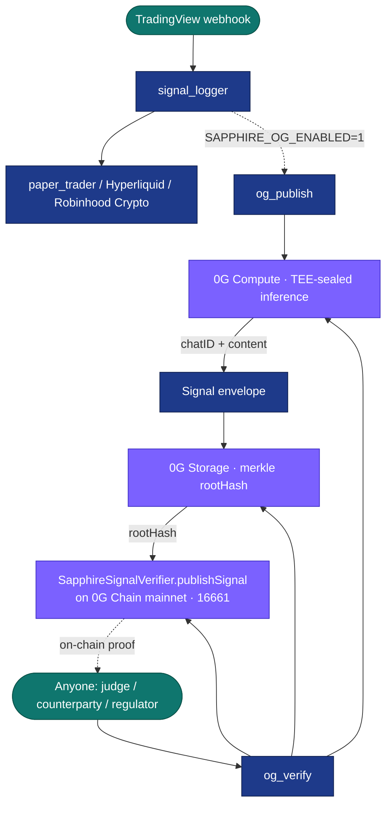

# Sapphire × 0G — Verifiable Autonomous Trading

> **0G APAC Hackathon submission · Track 2: Agentic Trading Arena (Verifiable Finance)**

Sapphire is a production autonomous trading + intelligence OS. For the 0G hackathon we add a **cryptographic settlement layer** so every trading signal is provably committed *before* the market moves on it.

## One-sentence pitch (≤30 words)

<!-- Test count sourced from `python3 scripts/ops/test_inventory.py --check-readme` on 2026-05-02 (6,567 tests collected: 6,000 core + 567 plugin). -->
The first production-grade trading OS (6,567 tests, live execution) to make every AI prediction cryptographically committed before market impact — sealed by 0G Compute, anchored on 0G Chain.

## Judge fast path

If you have 2 minutes, start here:

1. Open the public judge surface: `https://hack.sapphirealpha.xyz/` and expand **Sapphire × 0G**.
2. Click the **0G proof** tab. It shows the Compute → Storage → Chain → `og_verify` proof flow, public artifacts, and pending mainnet gaps without requiring a wallet.
3. Read the machine-readable proof manifest:
   - Standalone hackathon frontend: `https://hack.sapphirealpha.xyz/api/0g/readiness`
   - SapphireAlpha project page: `https://sapphirealpha.xyz/api/hackathon/0g-proof`
4. Once mainnet deploy is complete, verify the sample signal:

```bash
echo '{"signal_id": <id>}' | python3 plugins/claw-sapphire/tools/og_verify.py
```

Current public status is intentionally honest: the source code, verifier, and offline tests are ready; the final 0G mainnet contract, `SignalPublished` tx, and 0G Storage `rootHash` must be recorded after the operator signs the mainnet transaction.

## Why this is hard

When a trading agent claims it predicted BTC at $76,774, three properties must all be true: the prediction **existed before** the move, the model that produced it was **not tampered with**, and the inputs were **not backdated**. Without 0G, none of these are publicly verifiable — operators are trusted, not proven. Sapphire × 0G replaces that trust with cryptographic commitment: 0G Storage proves existed-before, 0G Compute (TEE) proves no-tampering, 0G Chain proves no-backdating.

## What 0G makes verifiable

For each trading signal the system generates:

1. **Untampered inference** — produced under TEE attestation (`broker.inference.processResponse(provider, chatID)`). The 0G Compute provider runs in a Trusted Execution Environment and returns a `chatID` that anyone can later use to verify the response was signed by the attested TEE.
2. **Existed-before-the-move** — content-addressed merkle commit on **0G Storage**. The full signal envelope (input, reasoning, output, TEE attestation) is uploaded and addressed by merkle `rootHash`.
3. **Not-backdated** — `SapphireSignalVerifier.publishSignal(strategyId, symbol, direction, confidence, proofHash=rootHash)` on **0G Chain mainnet (chainId 16661)** with block timestamp, immutably committing to the prediction.
4. **Independently verifiable** — anyone can re-derive the audit trail with the `og_verify` tool: read the on-chain entry → download the blob from 0G Storage → re-verify the merkle proof → re-verify the TEE attestation.

This closes the front-running window: by the time anyone learns the prediction *exists* (the on-chain anchor is public), the prediction is already cryptographically committed.

## Which 0G components are used

| Component | Where it shows up in code | What it secures |
|-----------|---------------------------|-----------------|
| **0G Storage** | [`lib/og/storage.py`](../../lib/og/storage.py), [`lib/og/_ts/og_storage.mjs`](../../lib/og/_ts/og_storage.mjs) | Content-addressed blob storage for the full signal envelope. |
| **0G Compute (Sealed Inference / TEE)** | [`lib/og/compute.py`](../../lib/og/compute.py) | The signal-generation inference call. Operator cannot retroactively rewrite history; provider attestation is on-chain. |
| **0G Chain (mainnet 16661)** | [`lib/og/chain.py`](../../lib/og/chain.py), [`contracts/SapphireSignalVerifier.sol`](../../contracts/SapphireSignalVerifier.sol) | Immutable, timestamped commitment to each prediction. |
| **0G payments + agent mandates** | [`contracts/SapphirePaymentGate.sol`](../../contracts/SapphirePaymentGate.sol), [`contracts/SapphireSentinelRegistry.sol`](../../contracts/SapphireSentinelRegistry.sol) | Subscription gating + agent spend mandates with on-chain payment receipts. |

### Live data flows that produce on-chain anchors

| Flow | Trigger | Code |
|---|---|---|
| **TradingView webhook signals** | Every TV alert that reaches `signal_logger` | [`lib/og/hooks.py`](../../lib/og/hooks.py) (fire-and-forget from [`services/alpha/src/signal_logger.py`](../../services/alpha/src/signal_logger.py)) |
| **Kronos daily predictions** | Daily after kronos-daily LaunchAgent completes | [`scripts/og_publish_kronos.py`](../../scripts/og_publish_kronos.py) — reads `data/intelligence/<date>/predictions.json`, publishes one anchor per watchlist asset |

## Architecture



The verifier path (`og_verify`) reads the on-chain signal, downloads the blob from 0G Storage with merkle proof verification, and surfaces the TEE chatID for off-chain `broker.inference.processResponse()` re-verification.

## Quick start (judges / reviewers)

```bash
git clone https://github.com/arigatoexpress/Sapphire.git
cd Sapphire
git checkout feat/0g-integration

# 1. Python + Node deps
pip install -r requirements.txt web3 eth-account py-solc-x
cd lib/og/_ts && npm install && cd ../../..

# 2. Copy the example env, fill in OG_PRIVATE_KEY (a *testnet* hot wallet)
cp .env.example .env  # then edit it
# Get testnet 0G from the faucet linked in https://docs.0g.ai

# 3. One-shot end-to-end smoke test on 0G testnet
bash scripts/hackathon_smoke.sh
```

The smoke script runs the whole flow: preflight → deploy → publish a synthetic signal → verify it round-trips through 0G Storage and 0G Chain.

To run individual steps:

```bash
# Preflight only (RPC / chain ID / key / balance)
python3 scripts/deploy_og_chain.py --check --network testnet

# Compile + write ABIs without deploying (no key needed)
python3 scripts/deploy_og_chain.py --abi-only

# Deploy
python3 scripts/deploy_og_chain.py --network testnet  # or --network mainnet

# Tests
pytest tests/unit/og_integration/ -q   # 56 0G integration tests
make test                               # 5,995+ core tests

# Publish a signal
echo '{"strategy":"kronos_btc_24h","symbol":"BTC-USD","action":"buy","score":83}' \
  | python3 plugins/claw-sapphire/tools/og_publish.py

# Verify by signal id (reads on-chain registry, downloads from 0G Storage)
echo '{"signal_id": 0}' | python3 plugins/claw-sapphire/tools/og_verify.py
```

## Mainnet contract addresses

> Filled in after `scripts/deploy_og_chain.py --network mainnet` completes.

| Contract | Address | Explorer |
|---|---|---|
| `SapphireSignalVerifier` | `0x...` | https://chainscan.0g.ai/address/0x... |
| `SapphirePaymentGate` | `0x...` | https://chainscan.0g.ai/address/0x... |
| `SapphireSentinelRegistry` | `0x...` | https://chainscan.0g.ai/address/0x... |

## What's safe to look at without keys

- **Public readiness APIs are read-only**: `/api/0g/readiness`, `/api/0g/feed`, and `/api/hackathon/0g-proof` expose only public proof artifacts and explicit pending gaps.
- **All code is open** under `lib/og/`, `plugins/claw-sapphire/tools/og_*.py`, `scripts/deploy_og_chain.py`, `contracts/`.
- **All tests run offline** with mocked SDK responses: `pytest tests/unit/og_integration/`.
- The Solidity contracts are unchanged from Sapphire's pre-existing deployment to Robinhood Chain testnet (Arbitrum Orbit) — review at `contracts/`. The hackathon contribution is the **0G integration glue**, not new contract logic.

## Safety

- **All 0G code is gated behind `SAPPHIRE_OG_ENABLED=1`.** With the flag unset (default), Sapphire's trading critical path is byte-identical to its pre-hackathon behavior. We did not move live trading execution onto 0G.
- **0G publish is fire-and-forget.** A failed 0G publish logs to `data/system_events.jsonl` but never delays a webhook response or blocks a trade.
- **Private keys never cross the Python ↔ Node boundary in plain text.** The Node helper reads `OG_PRIVATE_KEY` from its own subprocess env, which is set by `lib/og/storage.py`.
- See [`docs/hackathon-0g/design.md`](design.md) for the full design + safety analysis.

## Repo links

- **Demo script** — [`docs/hackathon-0g/demo-script.md`](demo-script.md)
- **Submission checklist** — [`docs/hackathon-0g/submission-checklist.md`](submission-checklist.md)
- **X post draft** — [`docs/hackathon-0g/x-post.md`](x-post.md)
- **Design doc** — [`docs/hackathon-0g/design.md`](design.md)

## Team

Solo builder: Ari Spec ([@arigatoexpress](https://github.com/arigatoexpress)) — building Sapphire OS as a long-running autonomous trading + intelligence stack.

## See also

- **Sapphire Sentinel — London Buildathon submission** ([`docs/hackathon/sapphire-sentinel-london-2026.md`](../hackathon/sapphire-sentinel-london-2026.md)): same Sapphire stack, different hackathon angle. The 0G integration here is the *verifiable-finance* spine; Sentinel is the *agentic-safety* spine. They share contracts (`SapphireSentinelRegistry`) and the same testnet wallet path.
