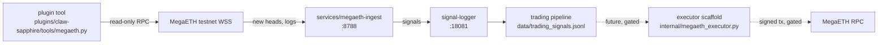

# MegaETH Integration

Sapphire's integration with MegaETH — a real-time, EVM-equivalent L2 — covers a read-only WSS ingest service, a plugin tool for ad-hoc queries, and a fail-closed executor scaffold for future on-chain trading.

This doc is the canonical overview. Activation steps are in [`docs/ops/megaeth-runbook.md`](../ops/megaeth-runbook.md).

---

## What MegaETH is

MegaETH is a real-time Ethereum L2 with heterogeneous node roles, EigenDA for data availability, and EVM equivalence inherited from Optimism Isthmus. Four node types specialize the workload:

- **Sequencer** — single active node that orders and executes transactions and assembles blocks.
- **Replica nodes** — receive state diffs / execution results and apply them locally without re-execution.
- **Full nodes** — re-execute every block to validate state transitions independently.
- **Provers** — generate stateless cryptographic proofs over executed blocks asynchronously.

Block cadence in the spec: mini-blocks roughly every 10 milliseconds with EVM blocks roughly every 1 second; the project's public TPS target is ~100k. Block data is posted to EigenDA, which returns a DA certificate.

EVM semantics are inherited from Optimism Isthmus (Ethereum Prague) unless explicitly overridden by MegaETH-specific features (dual gas model, multidimensional resource limits, gas detention, dynamic gas costs, system contracts).

Sources:

- MegaETH architecture page — https://docs.megaeth.com/architecture
- MegaETH spec page — https://docs.megaeth.com/spec/
- "Revisiting The World Computer" research paper — https://static.megaeth.com/Revisiting%20The%20World%20Computer.pdf
- MegaETH research index — https://www.megaeth.com/research

---

## Why we integrated it

Sapphire's existing on-chain trading paths (Hyperliquid L1, Robinhood Chain, the Solana wallet stack) cover off-Ethereum or app-specific venues. MegaETH adds:

1. **Real-time on-chain trading** — sub-second EVM blocks let signal-to-execution latency rival CEX-style rails while keeping settlement on an EVM L2. Slower L2s (Optimism / Arbitrum / Base ~250ms-2s) preclude this class of strategy.
2. **MEV / orderflow strategies** — the single-sequencer model and ~10ms mini-blocks make orderflow and inclusion-window strategies tractable from a Mac-side bot, without running a builder.
3. **EVM equivalence** — existing Sapphire Solidity contracts (`SapphireSignalVerifier`, `SapphirePaymentGate`, `SapphireSentinelRegistry`) port without code changes.

This integration does **not** enable live MegaETH trading. The executor lands fail-closed; mainnet activation is gated on the steps in section "Activation gates" below.

---

## Architecture

Components owned by separate lanes:

| Lane | Component | Path |
|---|---|---|
| 1 | RPC client + plugin tool | `plugins/claw-sapphire/tools/megaeth.py`, `lib/chain/megaeth.py` |
| 2 | Ingest service | `services/megaeth-ingest/` (LaunchAgent, health on `:8788`) |
| 3 | Executor scaffold (gated) | `plugins/claw-sapphire/tools/internal/megaeth_executor.py` |
| 4 (this) | Docs + integration test harness | `docs/integrations/megaeth.md`, `docs/ops/megaeth-runbook.md`, `tests/integration/megaeth/` |

Lane 4 references but does not depend on Lanes 1–3 merging first. Path names above are the agreed contract; implementations land independently.

---

## Environment variables

| Variable | Default | Purpose |
|---|---|---|
| `SAPPHIRE_MEGAETH_RPC` | unset | HTTPS JSON-RPC endpoint. Required for plugin tool and executor. Find current testnet URL on https://docs.megaeth.com (see "Finding current testnet endpoints" below). |
| `SAPPHIRE_MEGAETH_WSS` | unset | WSS subscription endpoint for the ingest service. Required by `services/megaeth-ingest`. |
| `SAPPHIRE_MEGAETH_TESTNET_KEY` | unset | Dev-fallback private key for the testnet wallet. Production must use macOS keychain (`security add-generic-password -a sapphire-megaeth -s sapphire -w`). |
| `SAPPHIRE_MEGAETH_DRY_RUN` | `1` | Executor dry-run flag. `1` = simulate, never broadcast. `0` = broadcast (blocked at multiple layers — see Activation gates). |
| `SAPPHIRE_MEGAETH_INTEGRATION` | unset | Test-harness gate. Set to `1` to opt into network-touching tests under `tests/integration/megaeth/`; otherwise the suite skips. |

Chain ID is a code constant in `lib/chain/megaeth.py` rather than an env var, so a misconfigured testnet/mainnet URL cannot silently change the chain the executor signs against.

---

## Killswitches

| File | Effect |
|---|---|
| `~/.sapphire/megaeth_ingest_pause` | Ingest service stops emitting signals on next poll cycle; existing connections close cleanly. Mirrors the routine-pause pattern from PR #392. |
| `~/.sapphire/megaeth_trading_pause` | Executor refuses every signal with `verdict: blocked, reason: killswitch_active`. Does not cancel open orders (none exist on a synchronous L2 in the same sense as a CLOB; the file blocks new tx broadcasts). |

Both are presence-only (content ignored). `touch <path>` to enable, `rm <path>` to clear.

---

## Activation gates for trading

The executor is fail-closed by default. Mainnet broadcasts require **all five** gates open. Mirror of the [Hyperliquid live-trading runbook](../ops/hyperliquid-live-trading-runbook.md) structure:

1. **Testnet rehearsal.** Run end-to-end on MegaETH testnet for at least 24 hours: ingest connected, signals flowing through `signal-logger`, executor in `SAPPHIRE_MEGAETH_DRY_RUN=1` logging would-be transactions to `data/megaeth_trades.jsonl`. No mainnet RPC configured at this stage.
2. **`signing_verified=True` code flip.** Like Hyperliquid: the executor refuses mainnet while `MegaETHLivePolicy.signing_verified=False` (the default). Flip it via PR after running a signing-verification script analogous to `scripts/ops/verify_hyperliquid_signing.py`. The PR body must include the verifier output. This is intentionally a code-level flip, not an env var, so it shows up in `git blame` and forces reviewer attention.
3. **Mainnet chain_id constant set.** The mainnet chain ID lives as a constant in `lib/chain/megaeth.py`. Until MegaETH publishes a stable mainnet chain ID, the constant is `None` and the executor refuses mainnet by raising at construction time. Setting it is a separate PR after mainnet announcement.
4. **Operator confirmation.** Sapphire's confirmation firewall (`lib/core/confirmation_firewall`) gates the first N live broadcasts: each one requires a Telegram operator-token reply within the confirmation window. Same pattern as the Robinhood live-capital posture from PR #340/#344.
5. **Gradual cap increase.** First mainnet rung: $5 max notional per tx, mirroring the Hyperliquid first-rung cap. Cap increases happen via PR after at least 14 days of clean fills (mirror of the Hyperliquid Sortino soak gate).

If any gate is shut, the executor either raises at startup, refuses signals at evaluation time, or downgrades to dry-run logging. There is no env-var override for any of the five.

---

## Finding current testnet endpoints

Endpoints are not hardcoded in this repo because they may change before mainnet. To find the current testnet RPC and WSS URLs:

1. Open https://docs.megaeth.com and navigate to the User Guide / Developer Docs section that lists endpoints.
2. Cross-check the listed endpoints against the MegaETH GitHub org (https://github.com/megaeth-labs) for any pinned status posts.
3. Set `SAPPHIRE_MEGAETH_RPC` and `SAPPHIRE_MEGAETH_WSS` from those values.
4. Sanity check with `curl -s -X POST -H "Content-Type: application/json" -d '{"jsonrpc":"2.0","method":"eth_chainId","params":[],"id":1}' "$SAPPHIRE_MEGAETH_RPC"` — chain ID should be a non-zero hex string.

If the testnet has been re-launched or rotated since this doc was written, the docs site is authoritative; do not infer endpoints from older blog posts.

---

## See also

- [`docs/ops/megaeth-runbook.md`](../ops/megaeth-runbook.md) — operator runbook (pre-flight, day-to-day, incident playbook, rotation, decommission).
- [`tests/integration/megaeth/`](../../tests/integration/megaeth/) — gated network-touching test harness.
- [`docs/ops/hyperliquid-live-trading-runbook.md`](../ops/hyperliquid-live-trading-runbook.md) — analogous live-trading activation flow for Hyperliquid.
