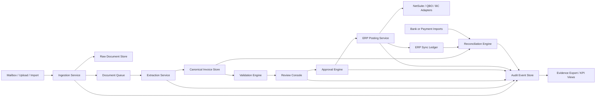

# Architecture

## Thesis

The first version should optimize for trust, control, and repeatability over novelty.

The system needs to be:

- accurate enough to reduce operator workload
- explicit enough to survive an audit
- modular enough to support multiple ERPs
- narrow enough to ship in under a year

## Non-Goals

- No giant suite architecture on day one.
- No direct handling of payment credentials or card data.
- No LLM-driven autonomous posting path.
- No SAP- or Dynamics-heavy customization in wave one.
- No workflow builder so broad that every customer becomes a consulting project.

## Core Flow

```text
ingest -> classify -> extract -> validate -> review -> approve -> post -> reconcile -> export
```

Each stage owns one responsibility:

- `ingest`
  Normalize mailbox, upload, and file imports into immutable document records.
- `classify`
  Detect invoice-like documents, duplicates, vendor hints, and source metadata.
- `extract`
  Run managed invoice parsing and write versioned structured output plus confidence.
- `validate`
  Apply deterministic business rules, duplicate checks, and coding constraints.
- `review`
  Present document and extracted fields side by side for operator correction.
- `approve`
  Route by amount, entity, department, and delegate policies.
- `post`
  Translate canonical records into ERP-specific bills, payments, and status sync.
- `reconcile`
  Match posted invoices and payments against ERP and bank or processor imports.
- `export`
  Produce audit evidence, change history, and KPI reporting.

## Default Cloud Stance

Use an AWS-first reference architecture unless GTM pulls hard toward Microsoft.

Why AWS first:

- strong startup-default tooling for queues, storage, and logging
- straightforward event-driven design
- mature managed primitives for tenancy, encryption, and observability
- easy path to swap OCR vendors later if the interface is kept clean

## Reference Stack

| Layer | Recommended default |
| --- | --- |
| Frontend | React or Next.js operator console |
| API and app tier | TypeScript services on ECS/Fargate or a modular monolith first |
| Relational store | Postgres on Aurora or managed Postgres |
| Raw documents | S3 with immutable versioning and checksums |
| Async jobs | SQS plus EventBridge |
| Search and audit queries | Postgres first, OpenSearch only after scale justifies it |
| OCR | Managed invoice parser behind an internal extraction interface |
| Auth | SSO-ready identity provider plus tenant-scoped RBAC |
| Secrets and keys | KMS-backed secrets manager |
| Observability | CloudWatch plus structured application logs and trace IDs |

## System Shape



## Service Boundaries

### Ingestion service

Owns:

- inbound mailbox polling or forwarding
- upload and file import endpoints
- source metadata capture
- checksum generation
- duplicate pre-checks on raw files

### Extraction service

Owns:

- OCR provider calls
- extraction model version tracking
- per-field confidence
- raw response storage
- normalized canonical payload generation

### Validation engine

Owns:

- required-field checks
- entity and currency rules
- vendor normalization hooks
- duplicate detection
- coding and amount constraints

### Approval engine

Owns:

- approval policy resolution
- amount and entity routing
- delegate and escalation rules
- approval state machine

### ERP posting service

Owns:

- canonical-to-adapter mapping
- idempotency keys
- retry policy
- outbound request journaling
- external ID persistence

### Reconciliation engine

Owns:

- payment import normalization
- match suggestions
- manual match overrides
- unmatched aging
- duplicate payment checks

### Audit and reporting layer

Owns:

- immutable event journal
- evidence export packs
- operational KPI views
- support replay context

## Canonical Data Model

Keep the ERP adapters thin by converging on a stable internal model:

```ts
type CurrencyCode = "USD" | "EUR" | "GBP" | string;

interface Company {
  id: string;
  name: string;
  baseCurrency: CurrencyCode;
  timezone: string;
}

interface ERPConnection {
  id: string;
  companyId: string;
  provider: "netsuite" | "qbo" | "business_central";
  status: "active" | "reauth_required" | "paused";
}

interface Invoice {
  id: string;
  companyId: string;
  vendorId?: string;
  sourceDocumentId: string;
  invoiceNumber?: string;
  invoiceDate?: string;
  dueDate?: string;
  currency: CurrencyCode;
  totalAmount?: number;
  confidence: number;
  status:
    | "ingested"
    | "needs_review"
    | "pending_approval"
    | "approved"
    | "posted"
    | "partially_paid"
    | "reconciled"
    | "rejected";
}

interface InvoiceLine {
  id: string;
  invoiceId: string;
  description?: string;
  quantity?: number;
  unitPrice?: number;
  amount?: number;
  accountCode?: string;
  costCenter?: string;
}

interface ApprovalStep {
  id: string;
  invoiceId: string;
  approverUserId: string;
  status: "pending" | "approved" | "rejected" | "delegated" | "expired";
  actedAt?: string;
}

interface ERPPosting {
  id: string;
  invoiceId: string;
  erpConnectionId: string;
  externalRecordId?: string;
  status: "queued" | "succeeded" | "failed";
  idempotencyKey: string;
}

interface Payment {
  id: string;
  invoiceId: string;
  externalPaymentId?: string;
  amount: number;
  paidAt?: string;
}

interface BankTransaction {
  id: string;
  companyId: string;
  amount: number;
  postedAt: string;
  reference?: string;
}

interface ReconciliationMatch {
  id: string;
  paymentId?: string;
  bankTransactionId?: string;
  invoiceId?: string;
  status: "suggested" | "confirmed" | "rejected";
  confidence: number;
}

interface AuditEvent {
  id: string;
  companyId: string;
  actorType: "user" | "system" | "service";
  actorId?: string;
  eventType: string;
  objectType: string;
  objectId: string;
  payload: Record<string, unknown>;
  createdAt: string;
}
```

## Integration Waves

### Wave 1

- NetSuite
- QuickBooks Online

### Wave 2

- Business Central

### Wave 3

- Dynamics Finance through implementation-led patterns
- SAP through partner-led or middleware-heavy deployments

## Control Requirements

These are non-negotiable from day one:

- immutable raw document storage and checksum
- extraction snapshot with provider and model version
- before and after values for manual edits
- full approval chain with timestamps
- outbound ERP payload journal and response trace
- reconciliation state transitions and evidence
- tenant-scoped authorization checks on every object access
- secret and key access logging

## LLM Policy

LLMs may assist with:

- exception summarization
- vendor or memo normalization suggestions
- operator-facing explanation of why a record failed validation

LLMs may not:

- post an invoice directly
- override deterministic validation
- auto-approve an invoice
- mark a reconciliation match final without a rules-based path

## Suggested Repo Shape

```text
invoice-recon/
├── apps/
│   └── operator-console/
├── packages/
│   ├── canonical-model/
│   ├── ingestion/
│   ├── extraction/
│   ├── validation/
│   ├── approvals/
│   ├── erp-adapters/
│   ├── reconciliation/
│   └── audit/
├── docs/
└── infra/
```

## First Build Sequence

1. Canonical model, tenant model, and audit event schema
2. Ingestion pipeline and immutable document storage
3. Extraction interface plus confidence and correction loop
4. Review console and validation engine
5. Approval engine
6. One ERP adapter with idempotent posting
7. Reconciliation engine
8. Reporting and evidence export
