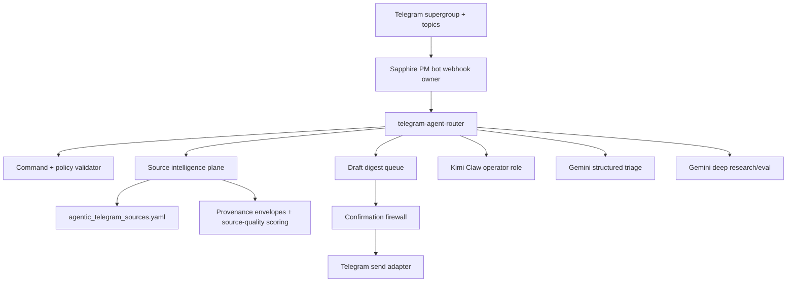

# Agentic Telegram Refactor With Kimi, Gemini, And High-Signal Feeds

Date: 2026-05-10

This is the safe refactor target for turning Sapphire's Telegram surface into
an agent operations bus: Kimi Claw in the group as the long-context operator,
Gemini on GCP as structured triage/research/eval, and a rights-aware feed
registry supplying markets, crypto, macro, news, cyber, and physical-world
signals.

The immediate implementation artifact is
`config/agentic_telegram_sources.yaml`, validated by
`lib/telegram/agentic_sources.py`. The registry deliberately defaults to
`telegram_send_default: dry_run_only` and
`local_inference_default: disabled`.

## Current Repo Truth

- `services/pm_bot/server.py` already prefers webhook mode, validates webhook
  secrets, preserves `message_thread_id` and `direct_messages_topic_id`, and
  refuses shared-token polling unless explicitly allowed.
- `docs/ops/telegram-operator-console-runbook.md` already documents the
  confirmation firewall, no-trading posture, allowlist, redaction, bounded
  commands, and dry-run service supervision.
- `services/telegram_intel/` already supports a private runtime channel config
  at `~/.sapphire/telegram_channels.yaml`, MTProto/Bot API backends, quality
  filtering, and envelope sidecars.
- `docs/DATA_SOURCES_EXPANSION_2026-05-03.md` ranked DefiLlama, FRED, GDELT,
  NASA FIRMS, SEC EDGAR, CISA/NVD, and BigQuery public datasets as the highest
  leverage source spine. This refactor converts that direction into a checked
  registry.

## Latest Platform Research

Telegram's Bot API changed materially in 2026. The official Bot API page lists
Bot API 10.0 on May 8, 2026, including guest mode, bot-to-bot communication
capabilities, richer poll media, message-reaction management, and business-bot
account-management changes. The same page makes the core transport constraint
clear: `getUpdates` and webhooks are mutually exclusive, and webhook requests
can be protected with `X-Telegram-Bot-Api-Secret-Token`.
Source: https://core.telegram.org/bots/api

Telegram's bot feature docs still emphasize command scopes, menu buttons, and
server-side command validation. That matches Sapphire's existing stance:
Telegram UI affordances are helpful, but backend authorization and command
validation remain authoritative.
Source: https://core.telegram.org/bots/features

Telegram Mini Apps are now the right surface for dense operator controls:
queue review, source toggles, digest preview, and approval buttons. Keep the
phone chat clean; move complex state review into a Mini App once the router and
draft queue exist.
Source: https://core.telegram.org/bots/webapps

Kimi's current official docs show Kimi K2.6 as the newest model, with stronger
long-context coding stability and text/image/video input. Kimi's tool-use docs
show OpenAI-compatible chat completion calls, strict JSON-schema-like function
calling, and up to 128 tools. This makes Kimi the best fit for Kimi Claw as
the long-horizon operator, code-surveyor, and group-collaboration agent.
Sources: https://platform.kimi.ai/docs/overview and
https://platform.kimi.ai/docs/api/tool-use

Google's Gemini docs position Gemini 2.5 Pro as the stable advanced reasoning
model, Gemini 2.5 Flash as price-performance, and Flash-Lite as the
high-throughput option. The Gemini API also supports function calling and
structured outputs, which are exactly what we want for source classification,
dedupe, digest shaping, and confidence/evidence schemas. Preview Gemini 3.x
models should be eval-only until model IDs, quotas, and GCP availability are
confirmed in our project.
Sources: https://ai.google.dev/gemini-api/docs/models,
https://ai.google.dev/gemini-api/docs/function-calling, and
https://ai.google.dev/gemini-api/docs/structured-output

## Target Architecture

The PM bot should remain the single Bot API ingress owner. Kimi Claw can be in
the Telegram group, but it should not share a bot token or run an independent
long-poller against the same bot. It can propose actions and digest text; the
Sapphire router decides what is authorized, what is queued as a draft, and what
requires Ari's confirmation.

## Model Routing

| Role | Default | Use | Notes |
|---|---|---|---|
| Long-horizon operator | `kimi-k2.6` | Kimi Claw, refactors, multi-tool planning, group collaboration | Fallback to `kimi-k2.5` if K2.6 is not available in the account. |
| Fast triage | `gemini-2.5-flash` | Deduping, headline classification, source SNR scoring, JSON digest shape | Use structured outputs and validate JSON before queueing. |
| Cheap high-throughput triage | `gemini-2.5-flash-lite` | Low-stakes clustering, embeddings-adjacent labels, repeated refreshes | No final operator conclusions. |
| Deep synthesis | `gemini-2.5-pro` | Weekly cited research packs, source postmortems, strategy memos | Research context only. |
| Latest-model eval lane | `gemini-3.1-pro-preview` or current GCP-visible preview | Compare against 2.5 Pro/Flash, not production gating | Preview lane must never auto-send. |

Decision: do not delete local inference yet, but stop using it as the default
for agentic Telegram. It remains a compatibility/runtime surface for existing
LaunchAgents until a measured cutover proves it can be retired. New Kimi/Gemini
Telegram work should treat local inference as disabled by default.

## Telegram Surface Upgrade Map

| Surface | Current state | Upgrade |
|---|---|---|
| Webhook ingress | Existing | Keep single-owner webhook; expand allowed updates intentionally. |
| Forum topics | Partial | Route by topic: `ops`, `markets`, `crypto`, `macro`, `cyber`, `research`, `drafts`. |
| Direct-message topics | Partial | Preserve context for direct-message topic replies. |
| Callback queries | Proposed | Inline buttons: approve draft, snooze source, escalate, open runbook. |
| Message reactions | Proposed | Reaction telemetry becomes source-quality feedback. |
| Polls | Proposed | Calibration polls and thesis checks, never execution. |
| Mini App | Proposed | Dense queue/source/review console. |
| Bot-to-bot group | Proposed | Kimi Claw can collaborate in group, but Sapphire router owns outbound sends. |
| Business bot features | Watchlist | Useful later for customer/comms surfaces, not needed for Ari operator group now. |

## Source Spine

The checked source registry now includes:

- Tier 0: private Telegram channel intel, DefiLlama, Hyperliquid public market
  data, FRED, SEC EDGAR, GDELT Cloud, CISA KEV.
- Tier 1: CoinGecko, Coinbase public market data, tier-1 RSS headlines, Kalshi,
  Polymarket, NVD, NASA FIRMS, USGS Earthquakes, BigQuery public crypto.
- Tier 2: Hugging Face Hub trend metadata.

The registry stores source owner, official URL, access/auth mode, cadence,
rights envelope, Telegram use, adapter hint, and constraints. It rejects
duplicate source IDs, unsafe default Telegram sends, local inference defaults,
and language that implies full-article/raw/paywalled redistribution.

Primary source docs:

- DefiLlama API: https://api-docs.defillama.com/
- FRED API: https://fred.stlouisfed.org/docs/api/fred/
- SEC EDGAR APIs: https://www.sec.gov/search-filings/edgar-application-programming-interfaces
- GDELT Cloud API v2: https://docs.gdeltcloud.com/api-reference/v2
- CoinGecko API: https://www.coingecko.com/en/api
- Coinbase Exchange APIs: https://docs.cdp.coinbase.com/exchange/introduction/welcome
- Hyperliquid info endpoint: https://hyperliquid.gitbook.io/hyperliquid-docs/for-developers/api/info-endpoint
- Kalshi public market data: https://docs.kalshi.com/getting_started/api_environments
- Polymarket API: https://docs.polymarket.us/api-reference
- CISA KEV: https://www.cisa.gov/known-exploited-vulnerabilities-catalog
- NVD API: https://nvd.nist.gov/developers/vulnerabilities
- NASA FIRMS active fire: https://firms.modaps.eosdis.nasa.gov/content/active_fire/
- USGS Earthquake GeoJSON: https://earthquake.usgs.gov/earthquakes/feed/v1.0/geojson.php
- BigQuery public datasets: https://cloud.google.com/bigquery/public-data
- Hugging Face Hub API: https://huggingface.co/docs/hub/en/api

## Agent Loop

1. Source adapters fetch or read only what their registry entry permits.
2. Each source emits a provenance envelope: source ID, retrieval time, URL,
   rights mode, freshness/TTL, normalized hash, and caveats.
3. Gemini Flash extracts structured facts, entities, source class, urgency,
   novelty, and duplicate keys.
4. Source-quality scoring ranks items by novelty, provenance, cross-source
   confirmation, time sensitivity, and Ari-interest profile.
5. Kimi Claw performs long-context synthesis only on the selected evidence set.
6. The router writes a draft to the digest queue with links and confidence.
7. Telegram shows a topic-scoped draft with inline controls, still dry-run.
8. Only a confirmed send path may publish to a real group.

## Cutover Sequence

1. Merge the registry and architecture note.
2. Add a read-only `/sources` PM bot command that renders registry health,
   source counts by domain, and disabled/local-inference posture.
3. Extend PM bot `allowed_updates` for callback queries and reactions in dry-run
   tests first. This is now wired as safe dry-run acceptance only: no
   `sendMessage`, no `answerCallbackQuery`, and no draft-state mutation.
4. Add `telegram-agent-router` as a small module, not a rewrite of the PM bot:
   parse update, validate actor/chat/topic, classify intent, route to command,
   source review, or draft queue.
5. Add a local draft queue table/file with provenance envelope references and
   confirmation state.
6. Implement GDELT Cloud and tier-1 RSS adapters next, because they fill the
   largest current news/market gap.
7. Add Kimi/Gemini provider config after secrets are confirmed present. Store
   model IDs and routing in config; never hard-code API keys.
8. Put Kimi Claw and the Sapphire PM bot into a Telegram supergroup with
   topics. Start with read-only group observations and dry-run drafts.

## Operator Setup For The Telegram Group

Create a supergroup with topics enabled:

- `ops`
- `markets`
- `crypto`
- `macro`
- `cyber`
- `research`
- `drafts`

Add the Sapphire PM bot as the Bot API ingress owner. Add Kimi Claw as the
long-context collaborator. Avoid granting broad admin rights at first. Only
grant the PM bot the minimum rights needed for the specific feature being
tested, such as reading commands or receiving reactions if that path is
enabled. Never configure two consumers to long-poll the same bot token.

## Hard Boundaries

- No real Telegram sends until the confirmation firewall is explicitly invoked.
- No live trading, order signing, deposits, withdrawals, or money movement from
  Telegram.
- No source credentials, API keys, user sessions, or channel lists committed to
  the repo.
- No paywall bypass, login-gated scraping, anti-bot evasion, or raw article
  redistribution.
- No preview model gates for production state changes.
- No deletion of local inference services until a separate measured cutover
  proves replacements and rollback.

## Next Engineering Slices

1. Dashboard tile backed by `load_registry()`.
2. `telegram-agent-router` module with actor/chat/topic validation and a local
   draft queue.
3. GDELT Cloud adapter with provenance envelopes.
4. RSS headline adapter with per-publisher output caps.
5. Kimi/Gemini provider router config and smoke tests that validate structured
   JSON without hitting live APIs by default.
