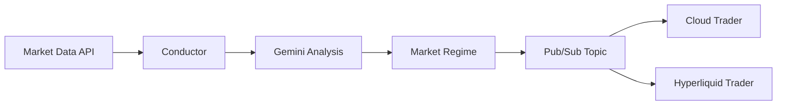

# 🧠 Symphony Conductor

The central AI brain of Agent Symphony that analyzes market conditions and publishes regime signals.

## Overview

Symphony Conductor uses **Gemini AI** to analyze market data and determine the current market regime, publishing signals to Google Cloud Pub/Sub for all trading services to consume.

## Architecture



## Market Regimes

| Regime | Description |
|--------|-------------|
| `BULL_TRENDING` | Strong uptrend with momentum |
| `BULL_VOLATILE` | Bullish but with significant swings |
| `BEAR_TRENDING` | Downtrend with selling pressure |
| `BEAR_VOLATILE` | Bearish with high volatility |
| `RANGE_BOUND` | Sideways consolidation |

## Key Files

| File | Description |
|------|-------------|
| `conductor.py` | Main service logic & Gemini integration |
| `Dockerfile` | Container configuration |

## Running Locally

```bash
python -m symphony_conductor.conductor
```

## Environment Variables

```bash
GCP_PROJECT_ID=sapphire-479610
GEMINI_API_KEY=your_gemini_key
```

## Deployment

```bash
gcloud builds submit --config cloudbuild_conductor.yaml .
gcloud run deploy symphony-conductor --image gcr.io/sapphire-479610/symphony-conductor \
  --platform managed --region northamerica-northeast1
```

## Pub/Sub Topic

- **Topic Name**: `symphony-strategy`
- **Message Format**: JSON with MarketRegime schema (see `symphony_lib/models.py`)
